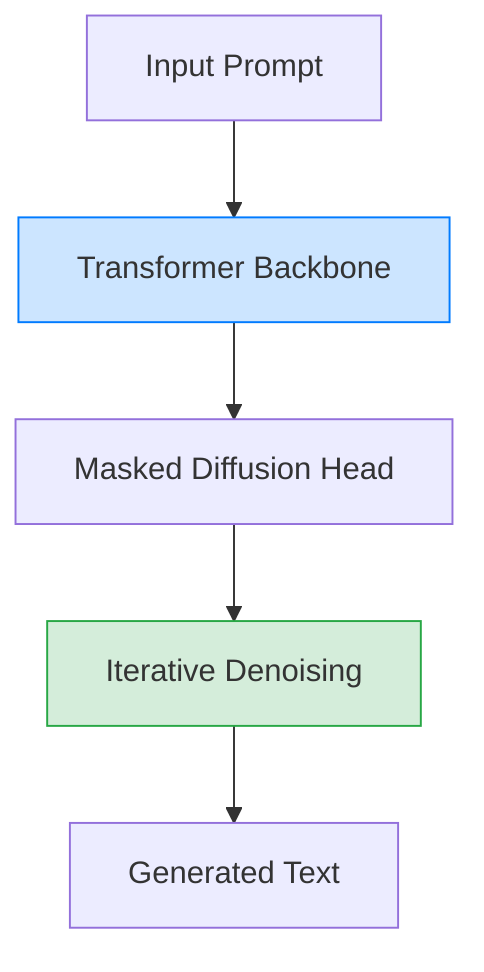

# Accelerating Diffusion Large Language Models with SlowFast Sampling: The Three Golden Principles

> **📅 Date:** 2025-06-12 | **🔗 Link:** [Paper](https://arxiv.org/abs/2506.10848) | **📂 Category:** [[Advanced Sampling Method]]

## 📖 Overview
*(Add summary after reading the paper)*

This paper contributes to the **Advanced Sampling Method** category of diffusion language models.

## 🔬 Core Methodology
- *(Key technique 1)*
- *(Key technique 2)*
- *(Key innovation)*

## 🔗 Related Papers
*(Add related papers using [[title]])*
- 

## 💡 Key Insights
- *(Takeaway 1)*
- *(Takeaway 2)*
- *(Practical implication)*

## 📝 Notes
*(Add your personal notes here)*

---
#diffusion-llm #advanced-sampling-method #research-paper
