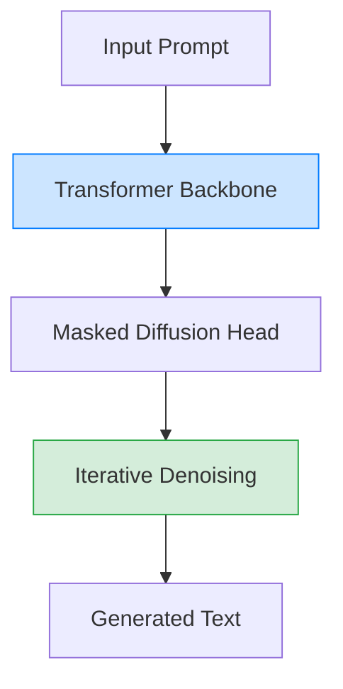

# LongLLaDA: Unlocking Long Context Capabilities in Diffusion LLMs

> **📅 Date:** 2025-06-17 | **🔗 Link:** [Paper](https://arxiv.org/abs/2506.14429) | **📂 Category:** [[Long Context]]

## 📖 Overview
*(Add summary after reading the paper)*

This paper contributes to the **Long Context** category of diffusion language models.

## 🔬 Core Methodology
- *(Key technique 1)*
- *(Key technique 2)*
- *(Key innovation)*

## 🔗 Related Papers
*(Add related papers using [[title]])*
- 

## 💡 Key Insights
- *(Takeaway 1)*
- *(Takeaway 2)*
- *(Practical implication)*

## 📝 Notes
*(Add your personal notes here)*

---
#diffusion-llm #long-context #research-paper
