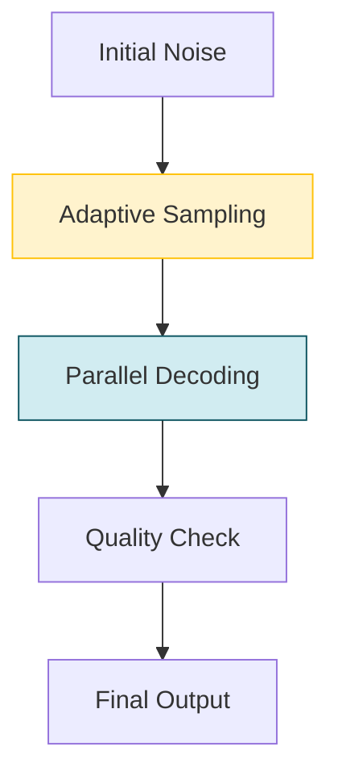

# Variational Autoencoding Discrete Diffusion with Enhanced Dimensional Correlations Modeling

> **📅 Date:** 2025-05-23 | **🔗 Link:** [Paper](https://arxiv.org/abs/2505.17384) | **📂 Category:** [[Advanced Sampling Method]]

## 📖 Overview
*(Add summary after reading the paper)*

This paper contributes to the **Advanced Sampling Method** category of diffusion language models.

## 🔬 Core Methodology
- *(Key technique 1)*
- *(Key technique 2)*
- *(Key innovation)*

## 🔗 Related Papers
- [[Accelerated Sampling from Masked Diffusion Models via Entropy Bounded Unmasking]]
- [[Accelerating Diffusion LLMs via Adaptive Parallel Decoding]]
- [[Accelerating Diffusion Large Language Models with SlowFast Sampling: The Three Golden Principles]]
- [[Wide-In, Narrow-Out: Revokable Decoding for Efficient and Effective DLLMs]]
- [[dKV-Cache: The Cache for Diffusion Language Models]]
- [[dLLM-Cache: Accelerating Diffusion Large Language Models with Adaptive Caching]]

## 💡 Key Insights
- *(Takeaway 1)*
- *(Takeaway 2)*
- *(Practical implication)*

## 📝 Notes
*(Add your personal notes here)*

---
#diffusion-llm #advanced-sampling-method #research-paper
