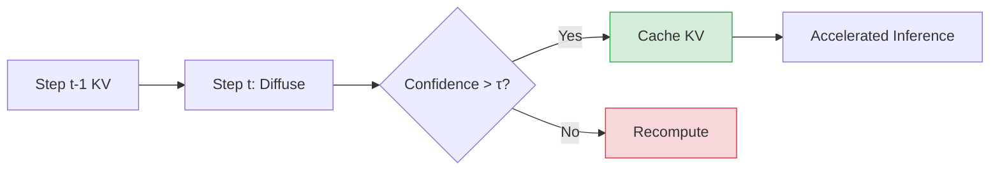

# Sparse-dLLM: Accelerating Diffusion LLMs with Dynamic Cache Eviction

> **📅 Date:** 2025-08-04 | **🔗 Link:** [Paper](https://arxiv.org/abs/2508.02558) | **📂 Category:** [[Fast Sampling KV Cache]]

## 📖 Overview
*(Add summary after reading the paper)*

This paper contributes to the **Fast Sampling KV Cache** category of diffusion language models.

## 🔬 Core Methodology
- *(Key technique 1)*
- *(Key technique 2)*
- *(Key innovation)*

## 🔗 Related Papers
- [[dKV-Cache: The Cache for Diffusion Language Models]]
- [[dLLM-Cache: Accelerating Diffusion Large Language Models with Adaptive Caching]]
- [[Accelerating Diffusion Language Model Inference via Efficient KV Caching and Guided Diffusion]]
- [[Fast-dLLM: Training-free Acceleration of Diffusion LLM by Enabling KV Cache and Parallel Decoding]]
- [[LLaDA: Large Language Diffusion Models]]
- [[Dream 7B]]
- [[Variational Autoencoding Discrete Diffusion with Enhanced Dimensional Correlations Modeling]]

## 💡 Key Insights
- *(Takeaway 1)*
- *(Takeaway 2)*
- *(Practical implication)*

## 📝 Notes
*(Add your personal notes here)*

---
#diffusion-llm #fast-sampling-kv-cache #research-paper
