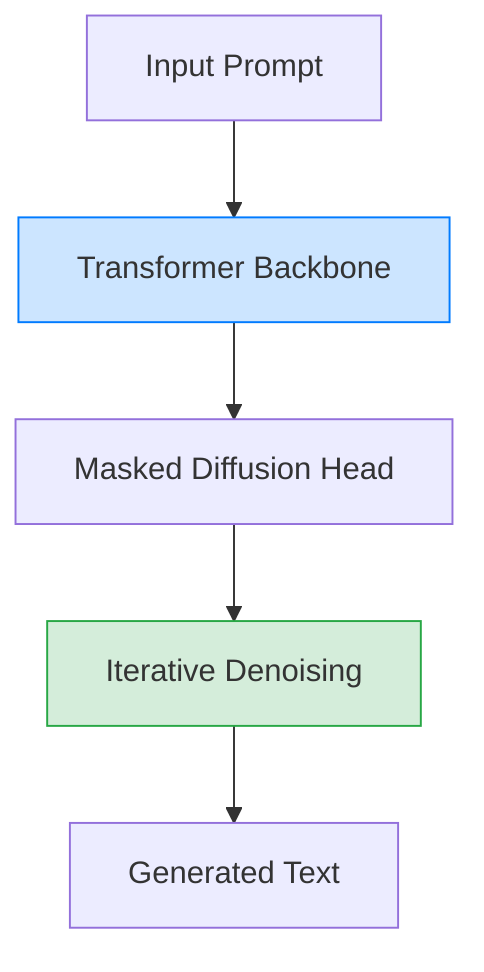

# LLaDA: Large Language Diffusion Models

> **📅 Date:** 2025-02-14 | **🔗 Link:** [Paper](https://arxiv.org/abs/2502.09992) | **📂 Category:** [[Foundation Model]]

## 📖 Overview
*(Add summary after reading the paper)*

This paper contributes to the **Foundation Model** category of diffusion language models.

## 🔬 Core Methodology
- *(Key technique 1)*
- *(Key technique 2)*
- *(Key innovation)*

## 🔗 Related Papers
- [[Dream 7B]]
- [[Seed Diffusion: A Large-Scale Diffusion Language Model with High-Speed Inference]]
- [[Deep Unsupervised Learning using Nonequilibrium Thermodynamics]]
- [[Structured Denoising Diffusion Models in Discrete State-Spaces]]
- [[dKV-Cache: The Cache for Diffusion Language Models]]

## 💡 Key Insights
- *(Takeaway 1)*
- *(Takeaway 2)*
- *(Practical implication)*

## 📝 Notes
*(Add your personal notes here)*

---
#diffusion-llm #foundation-model #research-paper
