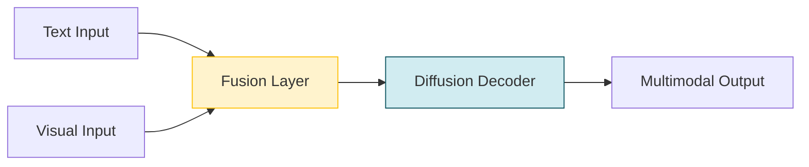

# LaViDa: A Large Diffusion Language Model for Multimodal Understanding

> **📅 Date:** 2025-05-22 | **🔗 Link:** [Paper](https://arxiv.org/abs/2505.16839) | **📂 Category:** [[Multimodal Understanding]]

## 📖 Overview
*(Add summary after reading the paper)*

This paper contributes to the **Multimodal Understanding** category of diffusion language models.

## 🔬 Core Methodology
- *(Key technique 1)*
- *(Key technique 2)*
- *(Key innovation)*

## 🔗 Related Papers
- [[LLaDA-V: Large Language Diffusion Models with Visual Instruction Tuning]]
- [[Dimple: Discrete Diffusion Multimodal Large Language Model with Parallel Decoding]]
- [[LLaDA: Large Language Diffusion Models]]
- [[Dream 7B]]

## 💡 Key Insights
- *(Takeaway 1)*
- *(Takeaway 2)*
- *(Practical implication)*

## 📝 Notes
*(Add your personal notes here)*

---
#diffusion-llm #multimodal-understanding #research-paper
