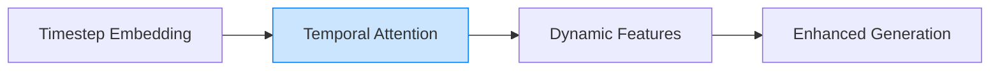

# Time Is a Feature: Exploiting Temporal Dynamics in Diffusion Language Models

> **📅 Date:** 2025-08-12 | **🔗 Link:** [Paper](https://arxiv.org/abs/2508.09138) | **📂 Category:** [[Others]]

## 📖 Overview
*(Add summary after reading the paper)*

This paper contributes to the **Others** category of diffusion language models.

## 🔬 Core Methodology
- *(Key technique 1)*
- *(Key technique 2)*
- *(Key innovation)*

## 🔗 Related Papers
- [[Thinking Inside the Mask: In-Place Prompting in Diffusion LLMs]]

## 💡 Key Insights
- *(Takeaway 1)*
- *(Takeaway 2)*
- *(Practical implication)*

## 📝 Notes
*(Add your personal notes here)*

---
#diffusion-llm #others #research-paper
