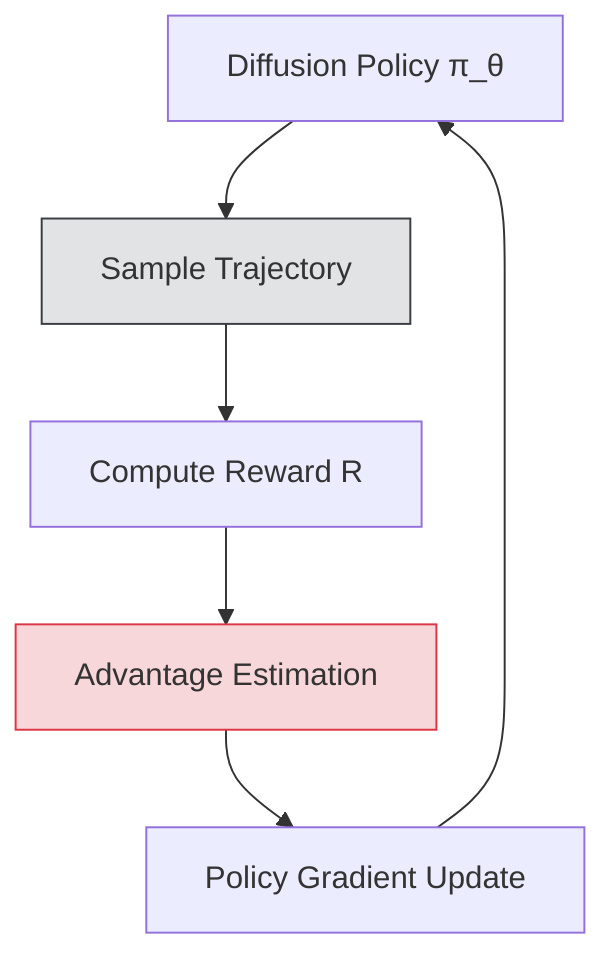

# Reinforcing the Diffusion Chain of Lateral Thought with Diffusion Language Models

> **📅 Date:** 2025-05-15 | **🔗 Link:** [Paper](https://arxiv.org/abs/2505.10446) | **📂 Category:** [[Reinforcement Learning]]

## 📖 Overview
*(Add summary after reading the paper)*

This paper contributes to the **Reinforcement Learning** category of diffusion language models.

## 🔬 Core Methodology
- *(Key technique 1)*
- *(Key technique 2)*
- *(Key innovation)*

## 🔗 Related Papers
- [[d1: Scaling Reasoning in Diffusion Large Language Models via Reinforcement Learning]]
- [[LLaDA 1.5: Variance-Reduced Preference Optimization for Large Language Diffusion Models]]
- [[DiffuCoder: Understanding and Improving Masked Diffusion Models for Code Generation]]
- [[MDPO: Overcoming the Training-Inference Divide of Masked Diffusion Language Models]]
- [[LLaDA: Large Language Diffusion Models]]
- [[Dream 7B]]

## 💡 Key Insights
- *(Takeaway 1)*
- *(Takeaway 2)*
- *(Practical implication)*

## 📝 Notes
*(Add your personal notes here)*

---
#diffusion-llm #reinforcement-learning #research-paper
