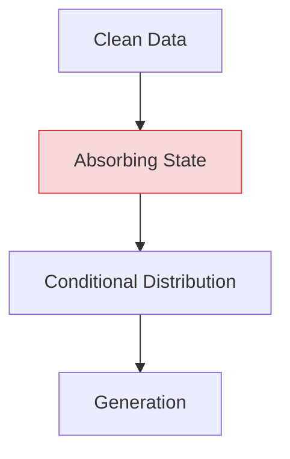

# Your Absorbing Discrete Diffusion Secretly Models the Conditional Distributions of Clean Data

> **📅 Date:** 2024-06-06 | **🔗 Link:** [Paper](https://arxiv.org/abs/2406.03736) | **📂 Category:** [[Theoretical Basis]]

## 📖 Overview
*(Add summary after reading the paper)*

This paper contributes to the **Theoretical Basis** category of diffusion language models.

## 🔬 Core Methodology
- *(Key technique 1)*
- *(Key technique 2)*
- *(Key innovation)*

## 🔗 Related Papers
- [[Deep Unsupervised Learning using Nonequilibrium Thermodynamics]]
- [[Structured Denoising Diffusion Models in Discrete State-Spaces]]
- [[Discrete Diffusion Modeling by Estimating the Ratios of the Data Distribution]]
- [[Simplified and Generalized Masked Diffusion for Discrete Data]]

## 💡 Key Insights
- *(Takeaway 1)*
- *(Takeaway 2)*
- *(Practical implication)*

## 📝 Notes
*(Add your personal notes here)*

---
#diffusion-llm #theoretical-basis #research-paper
