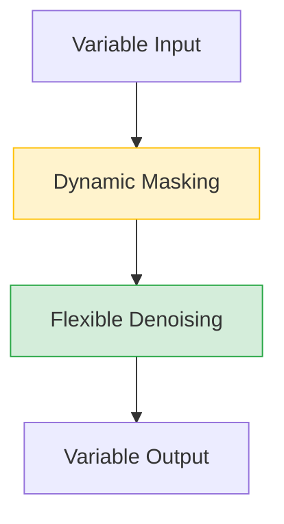

# Beyond Fixed: Variable-Length Denoising for Diffusion Large Language Models

> **📅 Date:** 2025-08-04 | **🔗 Link:** [Paper](https://arxiv.org/abs/2508.00819) | **📂 Category:** [[Variable Length]]

## 📖 Overview
*(Add summary after reading the paper)*

This paper contributes to the **Variable Length** category of diffusion language models.

## 🔬 Core Methodology
- *(Key technique 1)*
- *(Key technique 2)*
- *(Key innovation)*

## 🔗 Related Papers
- [[Edit Flows: Flow Matching with Edit Operations]]
- [[DreamOn: Diffusion Language Models For Code Infilling Beyond Fixed-Size Canvas]]
- [[Any-Order Flexible Length Masked Diffusion]]

## 💡 Key Insights
- *(Takeaway 1)*
- *(Takeaway 2)*
- *(Practical implication)*

## 📝 Notes
*(Add your personal notes here)*

---
#diffusion-llm #variable-length #research-paper
