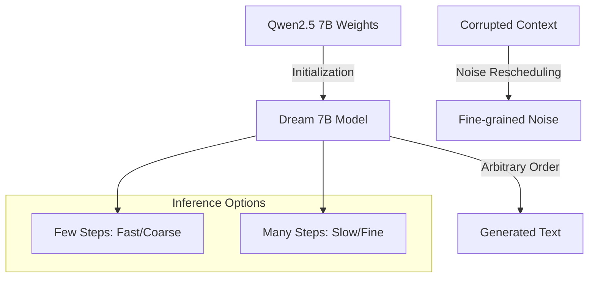

# Dream 7B

## Overview
Dream 7B is a powerful open-source diffusion LLM that stands out for its strong planning abilities and inference flexibility. It is initialized from an existing AR model to accelerate learning.

## Key Concepts
- **AR Initialization**: Instead of training from scratch, Dream 7B is initialized with weights from Qwen2.5 7B, significantly reducing the training tokens required.
- **Context-Adaptive Noise Rescheduling**: Dynamically reassigns noise levels for each token based on the surrounding corrupted context, improving token-level learning.
- **Planning Excellence**: Demonstrates superior performance in complex planning tasks (e.g., Sudoku, Countdown) compared to AR models and even some much larger models.
- **Inference Flexibility**: Supports arbitrary order generation (completion, infilling) and a tunable speed-quality trade-off.

## Architecture Diagram

## Relation to other papers
- Uses the adaptation strategy from DiffuLLaMA.
- Contrasts with [[LLaDA: Large Language Diffusion Models]] by using AR initialization instead of training from scratch.
