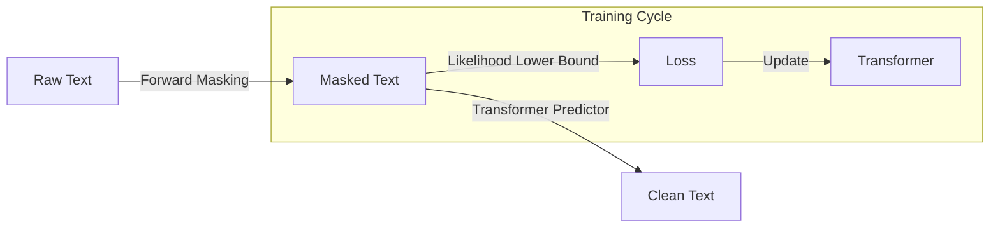

# LLaDA: Large Language Diffusion Models

## Overview
LLaDA is a large-scale diffusion language model trained from scratch. It challenges the assumption that LLM capabilities inherently depend on autoregressive (AR) architectures by demonstrating that a diffusion-based model can scale and perform comparably to AR baselines.

## Key Concepts
- **Masked Diffusion**: Employs a forward data masking process and a reverse generation process.
- **Scalability**: Shows that diffusion models can be scaled to 8B parameters and maintain competitive performance in in-context learning and instruction following.
- **Reversal Curse**: Significantly outperforms AR models (including GPT-4o) in tasks requiring the reversal of sequences (e.g., reversal poem completion), a known weakness of AR models.
- **Training**: Optimized using a likelihood lower bound.

## Architecture Diagram

## Relation to other papers
- Serves as the base for [[LLaDA-V: Large Language Diffusion Models with Visual Instruction Tuning]].
- Competes directly with [[Dream 7B]] in the foundation model space.
