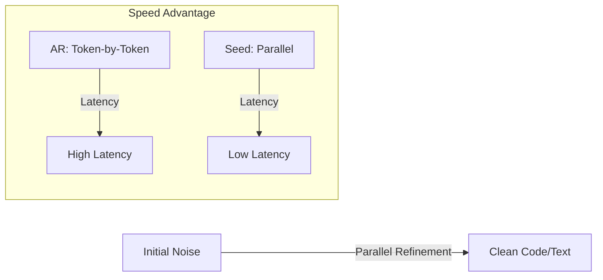

# Seed Diffusion: A Large-Scale Diffusion Language Model with High-Speed Inference

## Overview
Seed Diffusion focuses on solving the latency bottleneck of token-by-token decoding in LLMs by leveraging the parallel generation capabilities of discrete diffusion.

## Key Concepts
- **Extreme Speed**: Achieves an inference speed of over 2,100 tokens/sec on H20 GPUs.
- **Parallel Generation**: Unlike sequential AR decoding, it optimizes the entire sequence in parallel.
- **Pareto Frontier**: Establishes a new state-of-the-art on the speed-quality trade-off, especially for code generation.

## Architecture Diagram

## Relation to other papers
- Directly addresses the sampling speed issues that later "Fast Sampling" papers attempt to optimize via KV caches.
- Comparable to other high-speed implementations like Mercury Coder.
