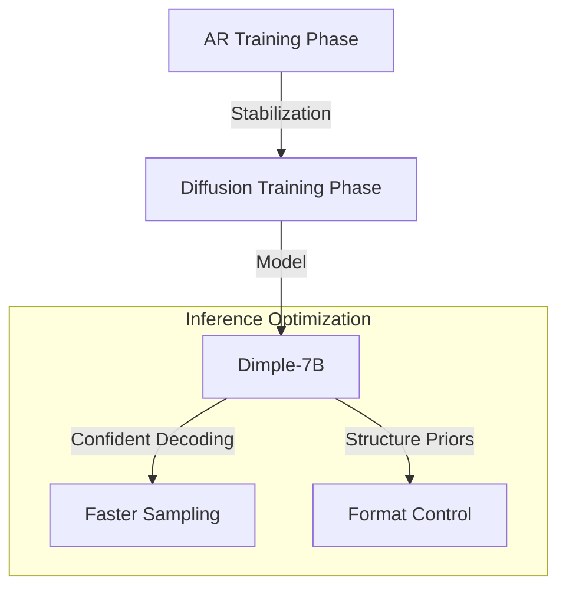

# Dimple: Discrete Diffusion Multimodal Large Language Model with Parallel Decoding

## Overview
Dimple is the first Discrete Diffusion Multimodal Large Language Model (DMLLM). It addresses training instability by using a hybrid training approach.

## Key Concepts
- **Hybrid Training**: Combines an initial autoregressive (AR) phase followed by a diffusion phase to stabilize training and reduce length bias.
- **Confident Decoding**: A decoding strategy that dynamically adjusts the number of tokens generated per step, reducing iterations to $\sim 1/3$ of the response length.
- **Structure Priors**: Allows the model to follow precise response formats and lengths through priors rather than just prompting.
- **Prefilling**: Implements AR-style prefilling to further speed up inference.

## Architecture Diagram

## Relation to other papers
- Demonstrates that DMLLMs can surpass AR counterparts like LLaVA-NEXT.
- Focuses heavily on the "sampling efficiency" problem discussed in the "Fast Sampling" family of papers.
