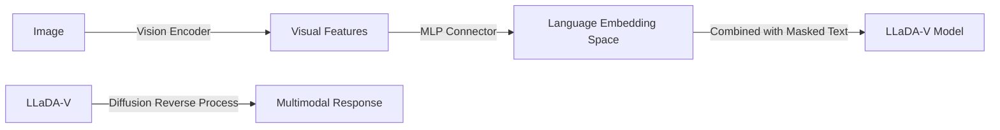

# LLaDA-V: Large Language Diffusion Models with Visual Instruction Tuning

## Overview
LLaDA-V is a purely diffusion-based Multimodal Large Language Model (MLLM) that integrates visual information into the LLaDA diffusion framework.

## Key Concepts
- **Pure Diffusion MLLM**: Departs from the dominant AR paradigm in multimodal models.
- **Architecture**: Integrates a vision encoder and an MLP connector to project visual features into the language embedding space.
- **Multimodal Alignment**: Uses visual instruction tuning to align vision and language within the diffusion process.
- **Performance**: Competitive with LLaMA3-V and shows better scalability with multimodal data.

## Architecture Diagram

## Relation to other papers
- Extends [[LLaDA: Large Language Diffusion Models]] to the multimodal domain.
- Part of the new wave of purely diffusion-based MLLMs alongside [[LaViDa: A Large Diffusion Language Model for Multimodal Understanding]].
