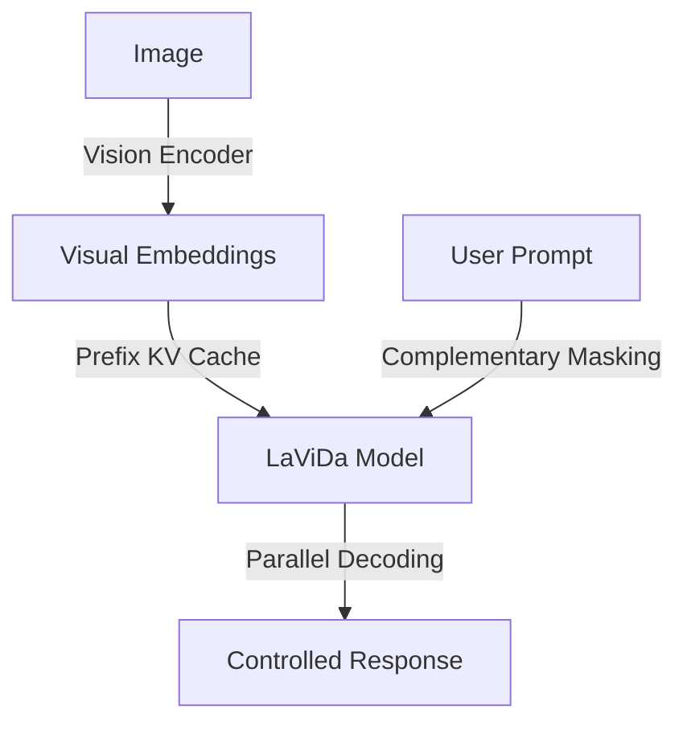

# LaViDa: A Large Diffusion Language Model for Multimodal Understanding

## Overview
LaViDa is a family of Vision-Language Models (VLMs) built on discrete diffusion models, emphasizing controllability and inference speed.

## Key Concepts
- **Control & Speed**: Leverages diffusion's parallel decoding for speed and bidirectional context for controlled generation (e.g., constrained formats).
- **Techniques**:
    - **Complementary Masking**: For more effective multimodal training.
    - **Prefix KV Cache**: Used to accelerate inference.
    - **Timestep Shifting**: Improves sampling quality.
- **Bidirectional Reasoning**: Excels in tasks like constrained poem completion.

## Architecture Diagram

## Relation to other papers
- Competes with AR VLMs like LLaVA.
- Shares a focus on inference acceleration seen in the "Fast Sampling" category.
