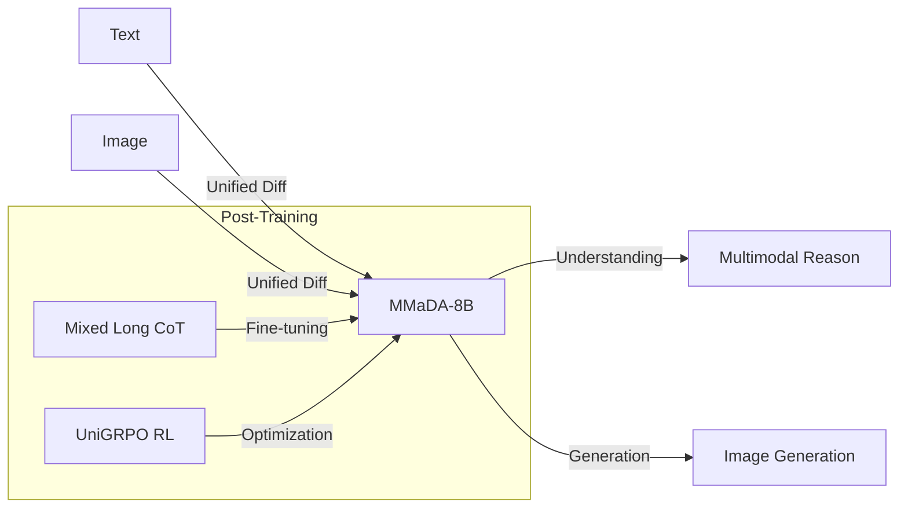

# MMaDA: Multimodal Large Diffusion Language Models

## Overview
MMaDA is a unified multimodal diffusion foundation model designed for textual reasoning, multimodal understanding, and text-to-image generation.

## Key Concepts
- **Unified Architecture**: A modality-agnostic design that eliminates the need for modality-specific components.
- **Mixed Long CoT**: A fine-tuning strategy that uses a unified Chain-of-Thought format across different modalities to align reasoning.
- **UniGRPO**: A unified policy-gradient-based RL algorithm (based on GRPO) tailored for diffusion models to unify post-training.
- **Versatility**: Excels at both understanding (comprehension) and generation (text-to-image).

## Architecture Diagram

## Relation to other papers
- Represents the peak of "Unified" multimodal models, moving beyond simple "Visual Understanding" to include "Generation".
- Incorporates RL techniques similar to those explored in the "Reinforcement Learning" category.
