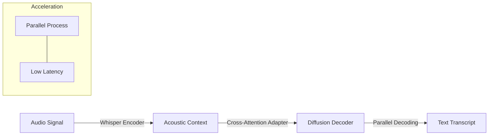

# Whisfusion: Parallel ASR Decoding via a Diffusion Transformer

## Overview
Whisfusion applies diffusion to Automatic Speech Recognition (ASR) to overcome the sequential bottleneck of AR decoders in long-form audio.

## Key Concepts
- **The Latency Bottleneck**: AR decoders generate tokens one by one; Whisfusion generates the entire transcription in parallel.
- **Architecture**: Fuses a pre-trained Whisper encoder (frozen/PEFT) with a text diffusion decoder.
- **Batch-Parallel Decoding**: A multi-step strategy that increases the number of candidates during decoding to boost accuracy.
- **Long-form Efficiency**: Up to 2.6x faster than AR baselines for utterances over 20 seconds.

## Architecture Diagram

## Relation to other papers
- Applies the discrete diffusion principles from the "Theoretical Basis" to a specialized domain (Speech/ASR).
- Shares a goal of parallel inference speed seen in [[Seed Diffusion]].
