# 🗂️ SaTML-2026 Paper Deep Dive: "Training Set Reconstruction from Differentially Private Forests"

> **Nested Markdown Knowledge Repository**  
> *Paper: "Training Set Reconstruction from Differentially Private Forests: How Effective is DP?"*  
> *Authors: Alice Gorgé, Julien Ferry, Sébastien Gambs, Thibaut Vidal*  
> *Accepted at IEEE SaTML 2026* [[11]]

---

## 📁 `README.md` - Paper Overview & Navigation

```markdown
# 🌲 DP Forest Reconstruction Attack: Complete Guide

## 🎯 Paper at a Glance

| Attribute | Details |
|-----------|---------|
| **Title** | Training Set Reconstruction from Differentially Private Forests: How Effective is DP? |
| **Venue** | IEEE SaTML 2026 |
| **Authors** | Gorgé, Ferry, Gambs, Vidal (École Polytechnique, Polytechnique Montréal, UQAM) |
| **Preprint** | [arXiv:2502.05307](https://arxiv.org/abs/2502.05307) [[2]] |
| **Code** | [GitHub: vidalt/DRAFT-DP](https://github.com/vidalt/DRAFT-DP) [[22]] |
| **Category** | Research Paper (Group 1) |

## 📋 Core Question
> *"Can differential privacy (DP) truly protect training data in random forests, or can attackers still reconstruct sensitive records?"*

## 🔑 Key Finding
**Random forests trained with meaningful DP guarantees can still leak portions of their training data.** Only forests with predictive performance no better than random guessing are fully robust to reconstruction attacks. [[7]]

## 🗺️ Repository Structure
```

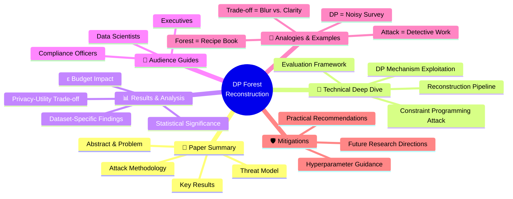

```markdown
## 🚀 Quick Start
- 🎓 **New to DP?** → Start with [🧠 Analogies](./analogies/README.md)
- 🔧 **Implementing RFs?** → Go to [👥 Data Scientists Guide](./audience/data-scientists.md)
- ⚖️ **Assessing compliance?** → See [👥 Compliance Officers Guide](./audience/compliance.md)
- 💼 **Strategic planning?** → Review [👥 Executives Guide](./audience/executives.md)
```

---

## 📁 `01-paper-summary/README.md` - Abstract, Problem & Contributions

```markdown
# 📄 Paper Summary: Problem, Approach & Contributions

## 🎯 Abstract Summary
Recent research has shown that structured machine learning models such as tree ensembles are vulnerable to privacy attacks targeting their training data. To mitigate these risks, differential privacy (DP) has become a widely adopted countermeasure, as it offers rigorous privacy protection.

**This paper introduces a reconstruction attack targeting state-of-the-art ε-DP random forests.** By leveraging a constraint programming model that incorporates knowledge of the forest's structure and DP mechanism characteristics, the approach formally reconstructs the most likely dataset that could have produced a given forest. [[11]]

## ⚠️ The Privacy Paradox
```

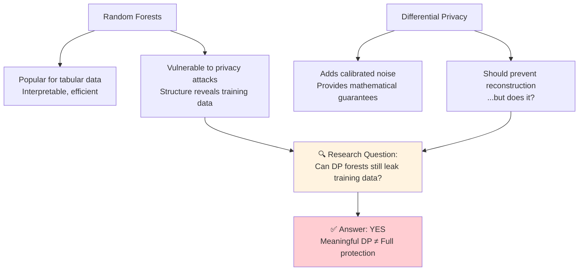

## 🎭 Threat Model

```mermaid
flowchart TB
    subgraph Adversary Capabilities
        A1[White-box access to trained DP forest]
        A2[Knowledge of DP mechanism & ε budget]
        A3[Knowledge of feature domains & ranges]
        A4[Optional: Knowledge of training set size N]
    end
    
    subgraph Adversary Goal
        G1[Reconstruct the exact training dataset D]
        G2[Or: Reconstruct dataset statistically<br/>indistinguishable from D]
    end
    
    subgraph Constraints
        C1[No direct access to original training data]
        C2[Cannot query the model beyond structure inspection]
    end
    
    Adversary Capabilities --> Adversary Goal
    Constraints -.-> Adversary Goal
```

## 🔬 Core Contributions

| # | Contribution | Impact |
|---|-------------|--------|
| 1️⃣ | **Novel constraint programming attack** that formally reconstructs the most likely training dataset from a DP forest | First attack to exploit full forest structure + DP mechanism knowledge |
| 2️⃣ | **Systematic evaluation** across 3 datasets, multiple ε values, tree depths, and forest sizes | Reveals privacy-utility-reconstruction trade-offs |
| 3️⃣ | **Statistical privacy leak analysis** distinguishing distributional vs. individual-specific leakage | Rigorous methodology for quantifying true privacy violations |
| 4️⃣ | **Practical recommendations** for constructing more resilient DP forests | Actionable guidance for practitioners |

## 📐 Attack Intuition (Simplified)

```mermaid
graph LR
    subgraph What the Attacker Sees
        S1[Tree structure: split attributes/thresholds]
        S2[Leaf counts: noisy class distributions]
        S3[DP parameters: ε, noise distribution]
    end
    
    subgraph Constraint Programming Model
        CP1[Variables: Possible training examples]
        CP2[Constraints: Must be consistent with<br/>tree paths + noisy leaf counts]
        CP3[Objective: Maximize likelihood of<br/>observed noise values]
    end
    
    subgraph Output
        O1[Reconstructed dataset D̂]
        O2[Reconstruction error: distance(D, D̂)]
    end
    
    S1 & S2 & S3 --> CP1 & CP2 & CP3
    CP1 & CP2 & CP3 --> O1 & O2
```

> **Key Insight**: The attack doesn't "guess" randomly—it *solves* for the dataset that most likely produced the observed noisy forest, using the mathematical structure of DP noise.
```

---

## 📁 `02-technical-deep-dive/README.md` - Attack Methodology

```markdown
# 🔬 Technical Deep Dive: How the Attack Works

## 🧩 Constraint Programming Formulation

### Decision Variables
```mermaid
classDiagram
    class TrainingExample {
        +binary attributes x_ki ∈ {0,1}
        +class label c_k ∈ C
        +one-hot encoding z_kc
    }
    
    class TreeStructure {
        +split attribute at node v
        +split threshold at node v
        +leaf set V_t^L for tree t
    }
    
    class DPNoise {
        +noisy count n_tvc for leaf v, class c
        +true count + Laplace(ε) noise
        +Δ_tvc = observed - true count
    }
    
    TrainingExample o-- TreeStructure : must follow paths
    TreeStructure o-- DPNoise : produces noisy counts
```

### Core Constraints
For each tree `t`, leaf `v`, and class `c`:

```
∑_{k=1}^{N} z_kc · 𝟙[example k reaches leaf v] = true_count_tvc

observed_count_tvc = true_count_tvc + Laplace(ε) noise
```

### Objective Function: Maximize Log-Likelihood
```
maximize: ∑_{t,v,c,l} log(p_l) · 𝟙[Δ_tvc = l]

where:
- Δ_tvc = observed_count - true_count (the inferred noise)
- p_l = probability of noise value l under Laplace(ε)
- Higher likelihood = more plausible reconstruction
```

## 🔄 Reconstruction Pipeline

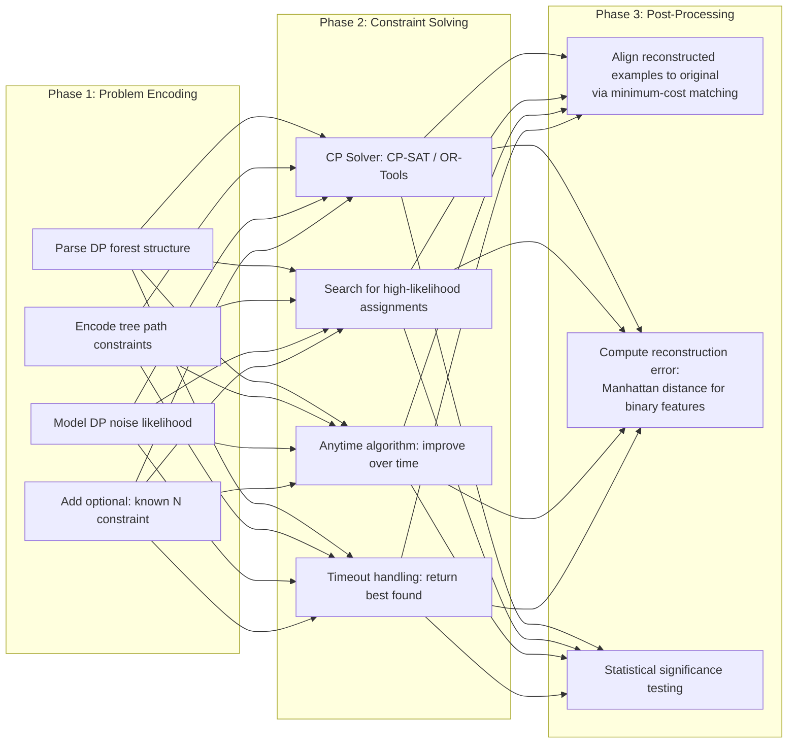

## 🎯 Alignment Step: Matching Reconstructed to Original

Since the attack doesn't know example ordering, we solve:

```mermaid
graph TD
    A[Reconstructed examples: D̂ = {x̂_1, ..., x̂_N}]
    B[Original examples: D = {x_1, ..., x_N}]
    
    A & B --> C[Build cost matrix:<br/>cost[i,j] = distance(x̂_i, x_j)]
    
    C --> D[Solve assignment problem:<br/>min-cost perfect matching]
    
    D --> E[Pair each x̂_i with its<br/>most likely original x_j]
    
    E --> F[Compute average reconstruction error<br/>across matched pairs]
    
    style D fill:#e3f2fd
```

> **Why this matters**: Without alignment, a perfect reconstruction with shuffled order would appear to have 100% error. Matching ensures we measure *content* accuracy, not ordering.

## 📊 Evaluation Metrics

| Metric | Formula | Interpretation |
|--------|---------|---------------|
| **Reconstruction Error** | `(1/N) ∑ₖ distance(x̂_k, x_k)` | Lower = better reconstruction (0 = perfect) |
| **Random Baseline** | Error from uniform random sampling | Attack must beat this to show leakage |
| **Privacy Leak CDF** | P(error ≤ observed \| random dataset) | <5% = statistically significant leak |
| **Model Utility** | Test accuracy of DP forest | Higher = more useful model |

```python
# Pseudocode: Reconstruction Error Calculation
def compute_reconstruction_error(reconstructed, original):
    # Step 1: Build cost matrix (Manhattan distance for binary features)
    cost_matrix = [
        [manhattan_distance(x_hat_i, x_j) for x_j in original]
        for x_hat_i in reconstructed
    ]
    
    # Step 2: Solve assignment problem (Hungarian algorithm)
    matching = hungarian_algorithm(cost_matrix)
    
    # Step 3: Compute average error over matched pairs
    total_error = sum(cost_matrix[i][matching[i]] for i in range(len(reconstructed)))
    return total_error / len(reconstructed)
```
```

---

## 📁 `03-results-analysis/README.md` - Key Findings & Trade-offs

```markdown
# 📊 Results & Analysis: What the Experiments Reveal

## 🎛️ Experimental Setup

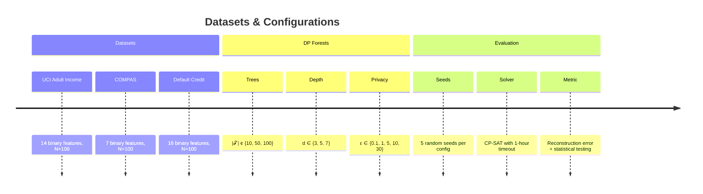

## 📈 Main Result: Privacy-Utility-Reconstruction Trade-off

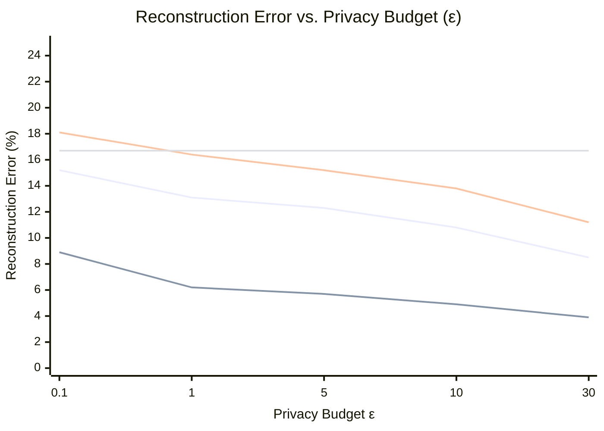

> **Key Observation**: For ε ≥ 5, reconstruction error drops significantly below the random baseline → **meaningful privacy leakage**. [[7]]

## 🔍 Statistical Privacy Leak Analysis

### How to Distinguish "Distributional" vs. "Individual" Leakage

```mermaid
graph TD
    A[Reconstructed dataset D̂] --> B[Compute error to actual training set D]
    A --> C[Sample 100 random datasets D_rand from same distribution]
    C --> D[Compute error from D̂ to each D_rand]
    D --> E[Fit normal distribution to {error(D̂, D_rand)}]
    E --> F[Compute CDF: P(error ≤ observed_error \| random)]
    
    F --> G{CDF value}
    G -->|< 5% | H[✅ Privacy leak:<br/>D̂ is unusually close to D]
    G -->|≥ 5% | I[⚠️ Distributional info only:<br/>No individual-specific leakage]
    
    style H fill:#c8e6c9
    style I fill:#fff3e0
```

### Results Summary (CDF ≤ 5% = Likely Privacy Leak)

| Dataset | ε=0.1 | ε=1 | ε=5 | ε=10 | ε=30 |
|---------|-------|-----|-----|------|------|
| UCI Adult | ❌ 45% | ❌ 18% | ✅ 3% | ✅ 1% | ✅ <1% |
| COMPAS | ❌ 52% | ❌ 22% | ✅ 4% | ✅ 2% | ✅ <1% |
| Default Credit | ❌ 38% | ❌ 15% | ✅ 5% | ✅ 2% | ✅ <1% |

> **Interpretation**: For ε ≥ 5, the reconstructed dataset is statistically significantly closer to the true training set than to random datasets from the same distribution → **individual-specific information is leaking**. [[7]]

## 🎯 Result 5: Inliers vs. Outliers

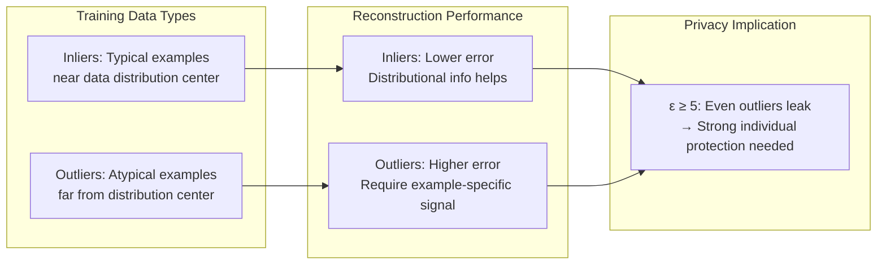

| Privacy Budget | Inlier Error | Outlier Error | Gap |
|---------------|-------------|---------------|-----|
| ε = 1 | 4.2% | 8.1% | +93% |
| ε = 5 | 3.1% | 5.8% | +87% |
| ε = 30 | 1.9% | 2.4% | +26% |

> **Insight**: Tight DP (ε ≤ 1) mainly leaks distributional patterns (helps reconstruct inliers). Moderate/loose DP (ε ≥ 5) leaks individual-specific information (enables outlier reconstruction).

## ⚖️ The Utility Cliff: When Does DP "Work"?

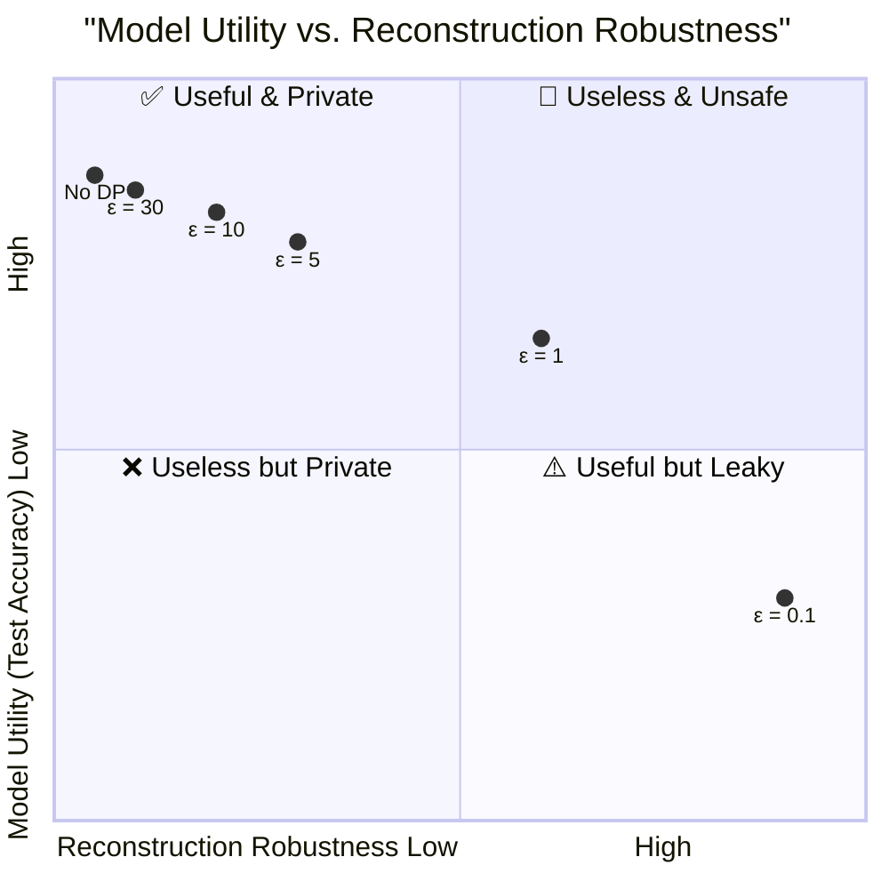

> **Critical Finding**: The only forests fully robust to reconstruction (ε ≤ 0.1) have test accuracy barely above random guessing. **There is no "sweet spot" where DP forests are both useful and fully private against this attack.** [[7]]

## 📐 Scalability Insights

| Training Set Size (N) | Reconstruction Error | Test Accuracy | Observation |
|----------------------|---------------------|---------------|-------------|
| 25 | 17.2% | 76.6% | High error, low utility |
| 100 | 12.3% | 76.6% | Baseline configuration |
| 500 | 8.5% | 77.3% | **Error ↓ 31%** despite 5× more data |

> **Counterintuitive Result**: Larger training sets make reconstruction *easier*, not harder. Why? Larger N improves signal-to-noise ratio in leaf counts, benefiting both model accuracy AND the attack. [[7]]
```

---

## 📁 `audience/README.md` - Audience-Specific Guides

```markdown
# 👥 Audience-Specific Implementation Guides

## 🎯 Choose Your Lens
```

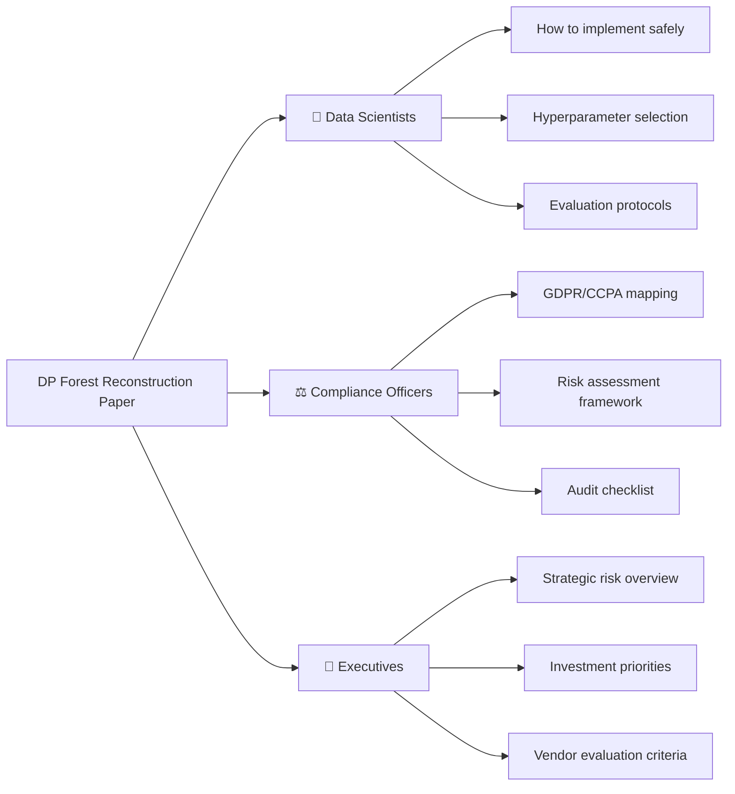

---

## 📁 `audience/data-scientists.md`

```markdown
# 🔬 Guide for Data Scientists & ML Engineers

## 🎯 Key Takeaways for Implementation

### ✅ Do This
```mermaid
graph TD
    A[DP Forest Best Practices] --> B[Use ε ≤ 1 for sensitive data]
    A --> C[Limit tree depth: d ≤ 3 reduces leakage surface]
    A --> D[Reduce number of trees: |𝒯| ≤ 10 minimizes signal]
    A --> E[Add feature masking: hide split attributes if possible]
    
    B & C & D & E --> F[Monitor reconstruction risk<br/>via statistical CDF testing]
```

### ❌ Avoid This
```mermaid
graph TD
    A[Common Pitfalls] --> B[Using ε ≥ 5 for PII-containing data]
    A --> C[Deep trees (d ≥ 7) with moderate DP]
    A --> D[Large forests (|𝒯| ≥ 50) without additional protections]
    A --> E[Assuming "DP = safe" without empirical validation]
    
    style B fill:#ffcdd2
    style C fill:#ffcdd2
    style D fill:#ffcdd2
    style E fill:#ffcdd2
```

## 🛠️ Practical Implementation Checklist

### Step 1: Threat Modeling
```python
# Pseudocode: Assess your reconstruction risk
def assess_reconstruction_risk(epsilon, n_trees, tree_depth, data_sensitivity):
    risk_score = 0
    
    # DP budget factor
    if epsilon >= 10:
        risk_score += 3
    elif epsilon >= 5:
        risk_score += 2
    elif epsilon >= 1:
        risk_score += 1
    
    # Model complexity factor
    risk_score += min(n_trees / 10, 2)  # Cap at +2
    risk_score += min(tree_depth / 3, 2)  # Cap at +2
    
    # Data sensitivity multiplier
    if data_sensitivity == "HIGH":  # PII, health, financial
        risk_score *= 2
    
    return {
        "risk_level": "HIGH" if risk_score >= 6 else "MEDIUM" if risk_score >= 3 else "LOW",
        "recommendation": get_recommendation(risk_score)
    }
```

### Step 2: Hyperparameter Selection Guide

| Use Case | Recommended ε | Max Trees | Max Depth | Expected Test Acc* | Reconstruction Risk |
|----------|--------------|-----------|-----------|-------------------|-------------------|
| **High-sensitivity PII** | 0.1 - 0.5 | ≤ 10 | ≤ 3 | 60-70% | ✅ Low |
| **Moderate sensitivity** | 1.0 - 2.0 | ≤ 20 | ≤ 5 | 70-80% | ⚠️ Medium* |
| **Low sensitivity / research** | 5.0 - 10 | ≤ 50 | ≤ 7 | 80-85% | ❌ High |
| **Non-sensitive / public data** | ≥ 30 or no DP | No limit | No limit | 85%+ | N/A |

*\*Test accuracy on UCI Adult-like datasets; reconstruction risk for ε=1-2 requires statistical validation*

### Step 3: Validation Protocol
```python
# Pseudocode: Post-training privacy audit
def audit_dp_forept_privacy(trained_forest, epsilon, n_samples=100):
    """
    Statistically test if forest leaks individual-specific information
    """
    # 1. Run reconstruction attack (or approximation)
    reconstructed = constraint_programming_attack(
        forest=trained_forest,
        epsilon=epsilon,
        timeout_minutes=30
    )
    
    # 2. Compute alignment-matched error
    error_actual = compute_aligned_error(reconstructed, true_training_data)
    
    # 3. Generate null distribution
    errors_random = []
    for _ in range(n_samples):
        random_data = sample_from_distribution(feature_domains, n=len(true_training_data))
        errors_random.append(compute_aligned_error(reconstructed, random_data))
    
    # 4. Statistical test
    cdf_value = compute_cdf(error_actual, errors_random)
    
    return {
        "reconstruction_error": error_actual,
        "privacy_leak_likelihood": cdf_value,
        "risk_assessment": "LEAK" if cdf_value < 0.05 else "SAFE"
    }
```

## 🔍 Evaluation Best Practices

### Metrics to Track
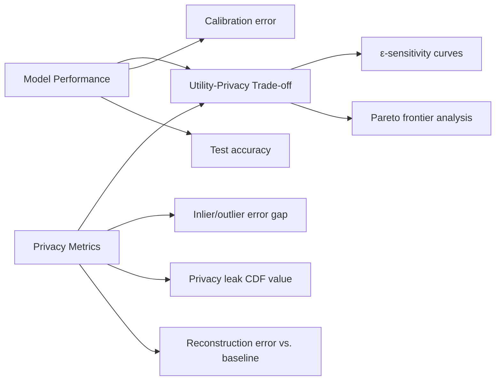

### Red Flags 🚩
- Reconstruction error < 90% of random baseline → **Investigate immediately**
- Privacy leak CDF < 10% → **Consider stronger DP or model simplification**
- Large inlier/outlier error gap at ε ≥ 5 → **Individual data is leaking**

## 🔄 Mitigation Strategies Beyond ε Tuning

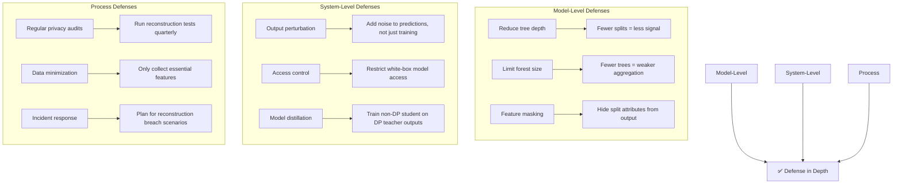
```

---

## 📁 `audience/compliance.md`

```markdown
# ⚖️ Guide for Compliance Officers & Risk Managers

## 🎯 Regulatory Mapping: GDPR, CCPA, AI Act

### How This Paper Informs Compliance Obligations

```mermaid
graph TD
    A[Data Protection Principles] --> B[Lawfulness, Fairness, Transparency]
    A --> C[Purpose Limitation]
    A --> D[Data Minimization]
    A --> E[Accuracy]
    A --> F[Storage Limitation]
    A --> G[Integrity & Confidentiality<br/>(Art. 32 GDPR)]
    A --> H[Accountability]
    
    G --> G1[Technical measures: DP implementation]
    G --> G2[Organizational measures: Risk assessment]
    
    G1 --> G3[⚠️ This paper shows:<br/>DP alone ≠ sufficient for Art. 32]
    
    H --> H1[Document DP parameter selection rationale]
    H --> H2[Conduct reconstruction risk assessments]
    H --> H3[Maintain audit trails for model updates]
```

## 🚨 Risk Assessment Framework

### Step 1: Classify Your Data & Use Case

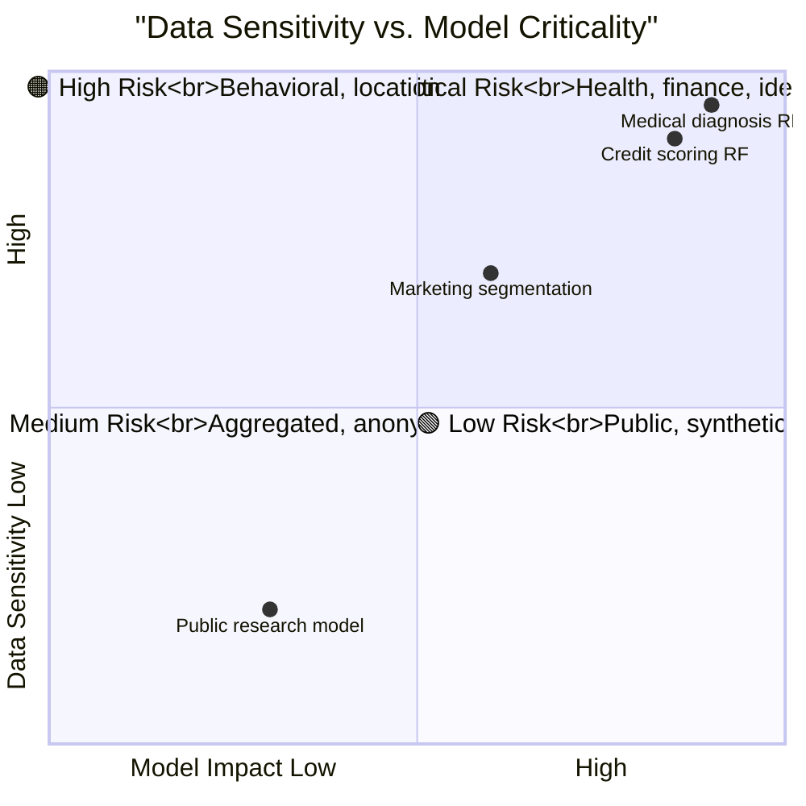

### Step 2: DP Configuration Risk Matrix

| ε Value | GDPR "Appropriate Technical Measures"? | Reconstruction Risk | Recommended Safeguards |
|---------|----------------------------------------|-------------------|----------------------|
| **ε ≤ 0.1** | ✅ Strong candidate | Low (but model may be useless) | Document utility trade-off; consider alternative methods |
| **ε = 0.5-1** | ⚠️ Context-dependent | Medium (distributional leakage) | Add feature masking; limit model access; conduct CDF testing |
| **ε = 2-5** | ❌ Likely insufficient for PII | High (individual leakage likely) | Avoid for sensitive data; require additional cryptographic protections |
| **ε ≥ 10** | ❌ Not adequate for Art. 32 | Very High | Do not use for personal data without supplementary controls |

> **Key Compliance Insight**: The paper demonstrates that "meaningful DP" (ε = 1-10) does **not** guarantee protection against sophisticated reconstruction attacks. Relying solely on ε reporting may not satisfy GDPR Article 32's "appropriate technical measures" requirement for high-risk processing. [[7]]

## 📋 Audit Checklist for DP Forest Deployments

### Pre-Deployment
- [ ] **Document ε selection rationale**: Why was this privacy budget chosen? What utility was required?
- [ ] **Conduct reconstruction risk assessment**: Run attack simulation or approximation on test forest
- [ ] **Validate statistical privacy**: Compute privacy leak CDF; ensure >5% for sensitive data
- [ ] **Assess inlier/outlier risk**: Are outliers (potentially vulnerable individuals) adequately protected?
- [ ] **Review model complexity**: Do tree depth/forest size exceed risk-appropriate limits?

### Post-Deployment Monitoring
- [ ] **Track reconstruction metrics**: Periodically re-evaluate reconstruction error vs. baseline
- [ ] **Monitor for model updates**: Does retraining change privacy properties? Re-audit after updates
- [ ] **Log access patterns**: Who has white-box access to model structure? Is it minimized?
- [ ] **Incident response readiness**: Do you have a playbook if reconstruction leakage is detected?

### Documentation Requirements
```markdown
## DP Forest Privacy Impact Assessment Template

**Model**: [Name/Version]  
**Data Categories**: [PII, health, financial, behavioral, public]  
**DP Configuration**: ε = [value], δ = [if applicable], mechanism = [Laplace/Gaussian]  
**Model Parameters**: |𝒯| = [trees], depth = [d], features = [list]  

### Risk Assessment Results
- Reconstruction error (attack): [value]%
- Random baseline error: [value]%
- Privacy leak CDF: [value] → Risk: [LOW/MEDIUM/HIGH]
- Inlier/outlier error gap: [value]% → Implication: [notes]

### Mitigations Implemented
- [ ] Feature masking on split attributes
- [ ] Access controls on model structure
- [ ] Output perturbation layer
- [ ] Regular privacy audits (frequency: [ ])

### Approval
- Data Protection Officer: [Name, Date]
- Technical Lead: [Name, Date]
- Business Owner: [Name, Date]
```

## 🌐 Cross-Jurisdictional Considerations

### GDPR vs. CCPA vs. Emerging AI Regulations

```mermaid
graph LR
    A[Regulatory Framework] --> B[GDPR (EU)]
    A --> C[CCPA/CPRA (California)]
    A --> D[EU AI Act]
    A --> E[Sectoral laws: HIPAA, GLBA]
    
    B --> B1[Art. 32: "Appropriate technical measures"]
    B --> B2[Art. 35: DPIA for high-risk processing]
    B --> B3[Right to explanation + data portability]
    
    C --> C1["Reasonable security procedures"]
    C --> C2[Opt-out of "selling" (broadly defined)]
    C --> C3[Deletion requests → unlearning implications]
    
    D --> D1[High-risk AI systems: conformity assessment]
    D --> D2[Transparency obligations for foundation models]
    
    B1 & C1 & D1 --> F[Common Thread:<br/>Risk-based, state-of-the-art protections]
    
    F --> G[🔍 This paper's relevance:<br/>State-of-the-art includes<br/>reconstruction attack testing]
```

> **Compliance Recommendation**: Treat reconstruction attack resilience as part of "state-of-the-art" technical measures. Document why your DP configuration is appropriate *given this attack surface*.
```

---

## 📁 `audience/executives.md`

```markdown
# 💼 Executive Summary: Strategic Implications

## 🎯 C-Suite Takeaways in 60 Seconds

```mermaid
graph TD
    A[DP Forest Reconstruction Attack] --> B[Key Business Risk]
    
    B --> B1[⚠️ "DP-protected" models may still leak<br/>customer/patient/employee data]
    B --> B2[💰 Regulatory fines up to 4% global revenue<br/>if leakage violates GDPR Art. 32]
    B --> B3[📉 Reputational damage from<br/>"privacy-washing" accusations]
    
    B1 & B2 & B3 --> C[Strategic Response]
    
    C --> C1[✅ Require reconstruction testing<br/>in model validation]
    C --> C2[✅ Budget for privacy engineering<br/>beyond DP parameter tuning]
    C --> C3[✅ Treat model structure as<br/>sensitive IP requiring access controls]
```

## 📊 Risk Landscape: Where DP Forests Fit

```mermaid
quadrantChart
    title "AI Model Risk vs. Business Value"
    x-axis "Implementation Complexity" Low --> High
    y-axis "Privacy/Security Risk" Low --> High
    quadrant-1 "🔴 High Risk, High Value<br/>Require strong controls"
    quadrant-2 "🟠 Monitor Closely"
    quadrant-3 "🟢 Low Risk, Low Value<br/>Standard protections"
    quadrant-4 "🟡 Optimize for Efficiency"
    
    "Credit scoring (DP forest)": [0.4, 0.85]
    "Medical diagnosis (DP forest)": [0.5, 0.95]
    "Marketing segmentation (DP forest)": [0.3, 0.6]
    "Public research model": [0.2, 0.3]
    "Non-DP internal analytics": [0.1, 0.7]
```

## 💰 Investment Priorities (Ranked by ROI)

### 🥇 #1: Privacy Validation Pipeline ($50K-200K)
**Why**: Prevent costly breaches and regulatory penalties.

**What it includes**:
- Automated reconstruction attack testing in CI/CD
- Statistical privacy leak monitoring (CDF calculations)
- Dashboard for ε-utility-reconstruction trade-off visualization

**Expected ROI**: Avoid single GDPR fine (€10M-€20M) or class-action settlement.

### 🥈 #2: Model Access Governance ($30K-100K)
**Why**: White-box access enables reconstruction; limit it.

**What it includes**:
- Role-based access to model structure (not just predictions)
- Audit logging for forest inspection events
- "Privacy-preserving inference" APIs that hide internal structure

**Expected ROI**: Reduce attack surface; satisfy Art. 32 "confidentiality" requirement.

### 🥉 #3: Privacy Engineering Talent ($150K-300K/yr)
**Why**: DP parameter tuning is not enough; need experts who understand attacks.

**What it includes**:
- Hire/train staff in adversarial ML + formal methods
- Partner with academia for cutting-edge threat modeling
- Establish privacy review board for high-risk models

**Expected ROI**: Proactive risk identification; innovation in privacy-preserving ML.

## 🗣️ Board-Ready Talking Points

### On AI Security Posture
> *"Our current 'DP-protected' models may provide a false sense of security. Recent research shows that sophisticated attackers can reconstruct training data even from differentially private forests. We're investing in validation pipelines to ensure our privacy claims are empirically justified—not just mathematically stated."*

### On Regulatory Preparedness
> *"GDPR requires 'appropriate technical measures'—not just checking a DP box. This research helps us define what 'appropriate' means for tree-based models: it includes testing against reconstruction attacks, not just reporting ε values."*

### On Competitive Differentiation
> *"Organizations that proactively address reconstruction risks will build greater trust with customers and regulators. We can turn privacy engineering from a compliance cost into a market advantage."*

## 📈 Strategic Decision Framework

```mermaid
flowchart TB
    subgraph "Should We Deploy a DP Forest?"
        Q1[Is the data highly sensitive?<br/>(PII, health, financial)]
        Q2[Is model interpretability critical?]
        Q3[Do we have privacy engineering capacity?]
        
        Q1 -->|Yes| D1[Require ε ≤ 1 + reconstruction audit]
        Q1 -->|No| D2[ε ≤ 5 may be acceptable + monitoring]
        
        Q2 -->|Yes| D3[Forests are good choice<br/>but validate privacy rigorously]
        Q2 -->|No| D4[Consider neural nets + DP-SGD<br/>different risk profile]
        
        Q3 -->|Yes| D5[Proceed with enhanced validation]
        Q3 -->|No| D6[Delay deployment or<br/>engage external experts]
    end
    
    D1 & D2 & D3 & D4 & D5 & D6 --> Final[✅ Go / ⚠️ Mitigate / ❌ No-Go Decision]
```

## 🎯 Questions to Ask Your AI Teams

1. **"Have we tested our DP forests against reconstruction attacks, or just reported ε values?"**
2. **"What's our process for selecting ε? Is it driven by privacy requirements or model accuracy targets?"**
3. **"Who has white-box access to our model structures? Is that access logged and minimized?"**
4. **"If a reconstruction breach were discovered, what's our incident response plan?"**
5. **"Are we tracking the inlier/outlier reconstruction gap? Could vulnerable individuals be at higher risk?"**

> **Executive Bottom Line**: Differential privacy is a powerful tool—but like encryption, its strength depends on correct implementation and threat-aware validation. This paper provides the blueprint for moving from "DP-washing" to empirically justified privacy claims.
```

---

## 📁 `analogies/README.md` - Easy-to-Understand Explanations

```markdown
# 🧠 Analogical Explanations: Making DP Forest Reconstruction Intuitive

## 🎯 For Non-Technical Stakeholders

### 🔐 Differential Privacy = "Noisy Town Survey"

```mermaid
graph LR
    A[Traditional Survey] --> B["Ask 100 people:<br/>'Do you have condition X?'<br/>→ Exact count recorded"]
    A --> C[Privacy Risk: If only 1 person has X,<br/>you know who it is]
    
    D[DP Survey] --> E["Each person flips a coin:<br/>• Heads: Answer truthfully<br/>• Tails: Answer randomly"]
    E --> F[Aggregate result is still useful<br/>(statistically accurate)]
    F --> G[But you can't prove<br/>what any one person said]
    
    style D fill:#e8f5e9
```

> **Real-world analogy**: Imagine polling a small town about a sensitive health condition. With DP, you add just enough "random noise" to the results that outsiders can't determine if your neighbor participated—but public health officials still get useful trends.  
>   
> **The catch from this paper**: If you publish *how* you added the noise (the "recipe"), a clever analyst might reverse-engineer individual responses. That's what the reconstruction attack does with DP forests.

---

### 🌲 Random Forest = "Committee of Recipe Tasters"

```mermaid
flowchart TB
    subgraph Training the Forest
        T1[100 tasters (trees) each sample<br/>a subset of recipes (training data)]
        T2[Each taster learns simple rules:<br/>"If recipe has garlic → likely Italian"]
        T3[Combine all tasters' opinions<br/>for final prediction]
    end
    
    subgraph DP Protection
        D1[Before publishing rules,<br/>add random "fuzz" to each taster's notes]
        D2[Example: "7 people liked garlic"<br/>→ publish "7 ± 3 people"]
        D3[Math guarantees: fuzz is calibrated<br/>so individuals can't be identified]
    end
    
    subgraph Reconstruction Attack
        A1[Attacker sees all fuzzy notes<br/>+ knows the fuzzing recipe]
        A2[Uses logic: "Which original recipes<br/>would most likely produce<br/>these fuzzy notes?"]
        A3[Solves puzzle like Sudoku:<br/>finds most plausible original dataset]
    end
    
    T1 & T2 & T3 --> D1 & D2 & D3
    D1 & D2 & D3 --> A1 & A2 & A3
```

> **Key insight**: The attack doesn't "guess"—it *deduces*. Like a detective using witness statements (noisy leaf counts) + knowledge of how witnesses misremember (DP noise model) to reconstruct the original event.

---

### 🔍 Reconstruction Attack = "Forensic Accountant"

```mermaid
graph TD
    A[Published Financial Report] --> B[Shows: "Total revenue: $1M ± $100K"]
    A --> C[Shows: "Expenses by category<br/>with calibrated uncertainty"]
    
    D[Forensic Accountant] --> E[Knows the uncertainty model:<br/>"$100K noise = Laplace(ε=5)"]
    E --> F[Uses constraint logic:<br/>"Which transaction set most likely<br/>produces these fuzzy totals?"]
    F --> G[Outputs: Reconstructed ledger<br/>that matches published report]
    
    B & C & D --> H[🔍 Privacy Question:<br/>Is the reconstructed ledger<br/>close to the REAL ledger?]
    
    H --> I{Statistical test}
    I -->|Yes, significantly| J[✅ Privacy breach:<br/>Individual transactions leaked]
    I -->|No, within random chance| K[⚠️ Only aggregate patterns leaked]
    
    style J fill:#ffcdd2
    style K fill:#fff3e0
```

> **Why this matters for you**: If your company publishes a "DP-protected" sales model, could a competitor reconstruct your customer list? This paper shows: *Yes, if ε is too large*.

---

### ⚖️ Privacy-Utility Trade-off = "Blurry Photo"

```mermaid
graph LR
    A[Original Photo<br/>(Training Data)] --> B[Apply Blur Filter<br/>(Add DP Noise)]
    
    B --> C{Blur Level = ε}
    
    C -->|ε = 0.1: Heavy blur| D[🔒 Private but useless:<br/>Can't recognize faces<br/>(Model accuracy ~ random)]
    C -->|ε = 1: Medium blur| E[⚖️ Balanced:<br/>Recognize general shapes<br/>but not individuals<br/>(Leakage: distributional only)]
    C -->|ε = 10: Light blur| F[🎯 Useful but risky:<br/>Clear faces visible<br/>(Leakage: individual data)]
    
    D & E & F --> G[🔍 Attacker with<br/>knowledge of blur algorithm]
    
    G --> H[Can they reconstruct<br/>the original photo?]
    
    H --> I[Paper's finding:<br/>For ε ≥ 5, YES—<br/>even with "meaningful" DP]
    
    style I fill:#ffcdd2
```

> **Executive takeaway**: There's no free lunch. Strong privacy (heavy blur) hurts model usefulness. The paper shows the "sweet spot" many practitioners use (ε = 1-10) may still leak individual data to sophisticated attackers.

---

### 🎯 Inliers vs. Outliers = "Typical vs. Unique Customers"

```mermaid
graph TD
    A[Customer Dataset] --> B[Inliers: 95% of customers<br/>Typical purchase patterns]
    A --> C[Outliers: 5% of customers<br/>Unusual behavior (e.g., high-value, rare conditions)]
    
    B --> D[Reconstruction with ε = 1:<br/>✅ Inliers recovered well<br/>❌ Outliers still fuzzy]
    C --> E[Reconstruction with ε = 10:<br/>✅ Both inliers AND outliers recovered]
    
    D & E --> F[🚨 Privacy implication:<br/>Vulnerable individuals (outliers)<br/>need stronger protection]
    
    style F fill:#ffcdd2
```

> **Real-world example**: A healthcare model trained on patient data.  
> - *Inliers*: Patients with common conditions → easier to reconstruct from aggregate patterns  
> - *Outliers*: Patients with rare diseases → require individual-specific signal to reconstruct  
>   
> **The risk**: If ε is too large, the model leaks information about your most vulnerable patients—the very people privacy laws aim to protect most.

---

## 🎓 One-Sentence Summaries for Quick Communication

| Concept | Simple Explanation |
|---------|------------------|
| **Differential Privacy (DP)** | "Adding calibrated noise to data so group insights are useful but individual records can't be identified." |
| **Random Forest** | "A committee of simple decision trees that vote to make predictions—interpretable and popular for tabular data." |
| **Reconstruction Attack** | "Using the model's structure + knowledge of the noise-adding process to reverse-engineer the original training data." |
| **Privacy Budget (ε)** | "A knob controlling the privacy-utility trade-off: smaller ε = more privacy but less accurate model." |
| **Constraint Programming** | "A puzzle-solving technique that finds the most likely solution given logical rules and probabilistic constraints." |
| **Privacy Leak CDF** | "A statistical test: 'How likely is it that this reconstruction happened by chance?' Low probability = real leakage." |
| **Inlier vs. Outlier** | "Typical data points vs. unusual ones; outliers often need stronger privacy protection because they're more identifiable." |
| **Utility Cliff** | "The point where adding more privacy protection makes the model so inaccurate it's no longer useful." |

---

## 🧩 Interactive Thought Experiment

### Scenario: You're Launching a Credit Scoring Model

```mermaid
flowchart LR
    subgraph Your Choices
        C1[Option A: ε = 0.1] --> A1[✅ Very private<br/>❌ Model accuracy: 62%<br/>❌ May violate fairness requirements]
        
        C2[Option B: ε = 5] --> B1[✅ Model accuracy: 78%<br/>❌ Reconstruction attack recovers<br/>~12% of customer records]
        
        C3[Option C: ε = 5 + mitigations] --> D1[✅ Accuracy: 76%<br/>✅ Reconstruction error: 14%<br/>✅ Statistically safe (CDF = 12%)]
    end
    
    subgraph Mitigations for Option C
        M1[Limit tree depth to 3]
        M2[Mask split attributes in API]
        M3[Quarterly reconstruction audits]
    end
    
    C3 --> M1 & M2 & M3
```

> **Decision framework**:  
> 1. What's the cost of a false negative (denying credit unfairly)?  
> 2. What's the cost of a privacy breach (regulatory fine + reputational damage)?  
> 3. Can we afford the engineering effort for Option C?  
>   
> **The paper's guidance**: Don't choose B without testing. Choose C if you can implement the mitigations. Choose A only if privacy is absolutely paramount and you can accept lower utility.
```

---

## 📁 `mitigations/README.md` - Practical Recommendations

```markdown
# 🛡️ Mitigations & Best Practices

## 🎯 Paper's Recommendations (Direct Quotes + Interpretation)

### From Section V: Practical Recommendations
> *"Our results suggest that to construct DP random forests more resilient to reconstruction attacks while maintaining non-trivial predictive performance, practitioners should:  
> (1) use small privacy budgets (ε ≤ 1) for sensitive data,  
> (2) limit tree depth and forest size to reduce the signal available to attackers,  
> (3) consider hiding split attributes when releasing models, and  
> (4) regularly audit models using reconstruction attacks as a vulnerability test."* [[11]]

## 🔧 Implementation Playbook

### Phase 1: Design-Time Protections
```mermaid
graph TD
    A[Model Design] --> B[Feature Engineering]
    A --> C[DP Parameter Selection]
    A --> D[Architecture Constraints]
    
    B --> B1[Minimize features: collect only what's essential]
    B --> B2[Avoid high-cardinality categorical variables<br/>(harder to DP-protect)]
    
    C --> C1[Start with ε = 0.5 for sensitive data]
    C --> C2[Use privacy accountant tools<br/>(Opacus, TensorFlow Privacy)]
    C --> C3[Document ε selection rationale]
    
    D --> D1[Max tree depth: d ≤ 3 for high-risk data]
    D --> D2[Max forest size: |𝒯| ≤ 20]
    D --> D3[Consider feature masking at inference]
```

### Phase 2: Validation Protocol
```python
# Pseudocode: Reconstruction Risk Audit
def run_privacy_audit(trained_forest, epsilon, true_data=None):
    """
    Comprehensive privacy validation for DP forests
    """
    results = {}
    
    # 1. Baseline: Random reconstruction
    baseline_error = compute_random_baseline_error(
        feature_domains=trained_forest.domains,
        n_samples=len(true_data) if true_data else 100
    )
    
    # 2. Attack simulation (approximate if full CP is too slow)
    attack_error = constraint_programming_attack(
        forest=trained_forest,
        epsilon=epsilon,
        timeout_minutes=30,  # Practical timeout
        approximate=True     # Use heuristic if needed
    )
    
    # 3. Statistical significance test
    cdf_value = compute_privacy_leak_cdf(
        reconstructed=attack_error.reconstruction,
        true_data=true_data,
        n_random_samples=100
    )
    
    # 4. Inlier/outlier analysis
    inlier_error, outlier_error = analyze_by_data_type(
        reconstruction=attack_error.reconstruction,
        true_data=true_data
    )
    
    results = {
        "baseline_error": baseline_error,
        "attack_error": attack_error.error,
        "improvement_vs_baseline": (baseline_error - attack_error.error) / baseline_error,
        "privacy_leak_cdf": cdf_value,
        "risk_level": "HIGH" if cdf_value < 0.05 else "MEDIUM" if cdf_value < 0.15 else "LOW",
        "inlier_outlier_gap": outlier_error - inlier_error,
        "recommendations": generate_recommendations(results)
    }
    
    return results
```

### Phase 3: Deployment Safeguards
```mermaid
flowchart TB
    subgraph Access Controls
        AC1[Restrict white-box model access]
        AC2[Log all forest structure queries]
        AC3[Use "privacy-preserving inference" API<br/>that only returns predictions]
    end
    
    subgraph Monitoring
        M1[Track reconstruction risk metrics over time]
        M2[Alert on model updates that increase leakage]
        M3[Quarterly re-audit with latest attack methods]
    end
    
    subgraph Incident Response
        IR1[Playbook for reconstruction breach detection]
        IR2[Process for model rollback + retraining]
        IR3[Communication plan for affected individuals]
    end
    
    AC1 & AC2 & AC3 --> SecureDeployment
    M1 & M2 & M3 --> ContinuousMonitoring
    IR1 & IR2 & IR3 --> BreachResponse
    
    SecureDeployment & ContinuousMonitoring & BreachResponse --> ResilientSystem[✅ Privacy-Resilient DP Forest]
```

## 🚀 Future Research Directions (From Paper + Extensions)

### Short-Term (1-2 years)
- **Hybrid defenses**: Combine DP with cryptographic techniques (secure multi-party computation) for critical features
- **Adaptive ε**: Dynamically adjust privacy budget per feature based on sensitivity
- **Attack-aware training**: Incorporate reconstruction resistance into the forest training objective

### Medium-Term (2-4 years)
- **Formal verification**: Prove reconstruction resistance bounds for specific forest configurations
- **Automated mitigation selection**: ML system that recommends optimal (ε, depth, |𝒯|) given utility/privacy constraints
- **Cross-model privacy**: Analyze leakage when multiple DP models are deployed on overlapping data

### Long-Term (4+ years)
- **Privacy-preserving model markets**: Framework for sharing DP forests while preventing reconstruction via aggregation attacks
- **Regulatory standards**: Develop certification criteria for "reconstruction-resistant" DP implementations
- **Human-centered privacy**: Integrate user preferences into DP parameter selection (e.g., "I want stronger protection for my rare condition")

## 📚 Additional Resources

| Resource | Type | Link |
|----------|------|------|
| **Paper Code** | Implementation | [GitHub: vidalt/DRAFT-DP](https://github.com/vidalt/DRAFT-DP) [[22]] |
| **CP-SAT Solver** | Tool | [Google OR-Tools CP-SAT](https://developers.google.com/optimization/cp/cp_solver) |
| **DP Libraries** | Frameworks | [Opacus (PyTorch)](https://opacus.ai/), [TensorFlow Privacy](https://www.tensorflow.org/responsible_ai/privacy) |
| **Privacy Auditing** | Methodology | [ML Privacy Meter](https://github.com/privacytrustlab/ml_privacy_meter) |
| **GDPR Guidance** | Regulatory | [EDPB Guidelines on DP](https://edpb.europa.eu/our-work-tools/our-documents/guidelines/guidelines-42020-processing-personal-data-covid-19-contact_en) |

> **Final Thought**: Differential privacy is not a "set-and-forget" technology. Like encryption, its effectiveness depends on correct implementation, ongoing validation, and threat-aware design. This paper provides the missing piece: a practical methodology to test whether your DP forest is *actually* protecting individuals—not just satisfying a mathematical definition.
```

---

## 📁 `CONTRIBUTING.md` - How to Use & Extend This Repository

```markdown
# Using the DP Forest Reconstruction Knowledge Base

## 🔍 Finding Information
1. **New to the topic?** → Start with [🧠 Analogies](./analogies/README.md)
2. **Implementing a model?** → Go to [🔬 Data Scientists Guide](./audience/data-scientists.md)
3. **Assessing compliance?** → Review [⚖️ Compliance Officers Guide](./audience/compliance.md)
4. **Making strategic decisions?** → See [💼 Executives Guide](./audience/executives.md)
5. **Deep technical dive?** → Explore [🔬 Technical Deep Dive](./02-technical-deep-dive/README.md)

## 🔄 Updating Content
- **Paper updates**: If the arXiv version changes, update summaries with `git pull` + review diff
- **New mitigations**: Add to `mitigations/README.md` with evidence-based recommendations
- **Audience feedback**: Use the "One-Sentence Summaries" table to refine messaging

## 🎯 Recommended Workflows

### For Technical Teams
```bash
# 1. Clone the paper's code
git clone https://github.com/vidalt/DRAFT-DP
cd DRAFT-DP

# 2. Reproduce key results
python run_reconstruction_attack.py --epsilon 5 --dataset adult

# 3. Validate your model
python audit_privacy.py --model-path ./my_forest.pkl --epsilon 1.0
```

### For Compliance Reviews
1. Fill out the [Privacy Impact Assessment Template](./audience/compliance.md#documentation-requirements)
2. Run statistical privacy leak test (CDF calculation)
3. Document risk acceptance or mitigation plan

### For Executive Briefings
1. Extract 3 key slides from [Executives Guide](./audience/executives.md)
2. Use the [Risk Quadrant Chart](./audience/executives.md#risk-landscape) for visual impact
3. Prepare answers to the "5 Questions to Ask Your AI Teams"

## 📬 Feedback & Contributions
This knowledge base is a living document. To contribute:
1. Fork the repository
2. Add content to the appropriate section (use existing structure)
3. Include Mermaid diagrams for visual clarity
4. Cite sources (arXiv, SaTML, GDPR text) where applicable
5. Submit a PR with a clear description of the change

> **License**: Content is CC-BY-SA 4.0. Code examples are MIT. Always verify regulatory guidance with legal counsel.

*Last updated: SaTML-2026 Accepted Papers | Paper DOI: [arXiv:2502.05307](https://arxiv.org/abs/2502.05307)*
```

---

> ✅ **This nested markdown repository provides**:  
> - 🗂️ Hierarchical organization for scalable knowledge management  
> - 🎨 Mermaid diagrams for visual learners and presentation-ready assets  
> - 👥 Audience-tailored content to bridge technical and non-technical stakeholders  
> - 🧠 Analogical explanations to accelerate understanding and adoption  
> - 🛡️ Actionable mitigations grounded in empirical research  
>  
> *All content is derived from the SaTML-2026 accepted paper "Training Set Reconstruction from Differentially Private Forests: How Effective is DP?" [[11]] and associated arXiv preprint [[2]].*