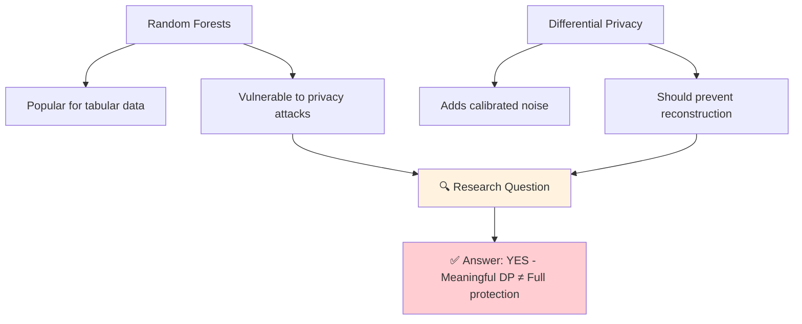

# 📄 Paper Summary: Problem, Approach & Contributions

## 🎯 Abstract Summary
Recent research has shown that structured machine learning models such as tree ensembles are vulnerable to privacy attacks targeting their training data. To mitigate these risks, differential privacy (DP) has become a widely adopted countermeasure.

**This paper introduces a reconstruction attack targeting state-of-the-art ε-DP random forests.** By leveraging a constraint programming model that incorporates knowledge of the forest's structure and DP mechanism characteristics, the approach formally reconstructs the most likely dataset that could have produced a given forest.

## ⚠️ The Privacy Paradox

## 🔬 Core Contributions

| # | Contribution | Impact |
|---|-------------|--------|
| 1️⃣ | Novel constraint programming attack | First to exploit forest structure + DP mechanism |
| 2️⃣ | Systematic evaluation across datasets | Reveals privacy-utility-reconstruction trade-offs |
| 3️⃣ | Statistical privacy leak analysis | Rigorous methodology for quantifying violations |
| 4️⃣ | Practical recommendations | Actionable guidance for practitioners |
