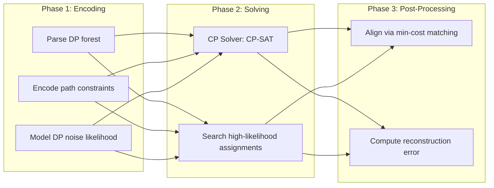

# 🔬 Technical Deep Dive: How the Attack Works

## 🧩 Constraint Programming Formulation

### Core Constraints
For each tree `t`, leaf `v`, and class `c`:

```
∑_{k=1}^{N} z_kc · 𝟙[example k reaches leaf v] = true_count_tvc
observed_count_tvc = true_count_tvc + Laplace(ε) noise
```

### Objective: Maximize Log-Likelihood
```
maximize: ∑_{t,v,c,l} log(p_l) · 𝟙[Δ_tvc = l]
where:
- Δ_tvc = observed_count - true_count
- p_l = probability of noise value l under Laplace(ε)
```

## 🔄 Reconstruction Pipeline



## 📊 Evaluation Metrics

| Metric | Formula | Interpretation |
|--------|---------|---------------|
| **Reconstruction Error** | `(1/N) ∑ₖ distance(x̂_k, x_k)` | Lower = better (0 = perfect) |
| **Random Baseline** | Error from uniform sampling | Attack must beat this |
| **Privacy Leak CDF** | P(error ≤ observed \| random) | <5% = significant leak |
| **Model Utility** | Test accuracy of DP forest | Higher = more useful |

```python
# Pseudocode: Reconstruction Error
def compute_reconstruction_error(reconstructed, original):
    cost_matrix = [[manhattan_distance(a, b) for b in original] for a in reconstructed]
    matching = hungarian_algorithm(cost_matrix)
    total = sum(cost_matrix[i][matching[i]] for i in range(len(reconstructed)))
    return total / len(reconstructed)
```
