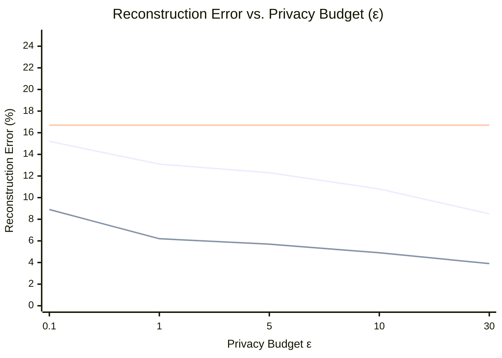
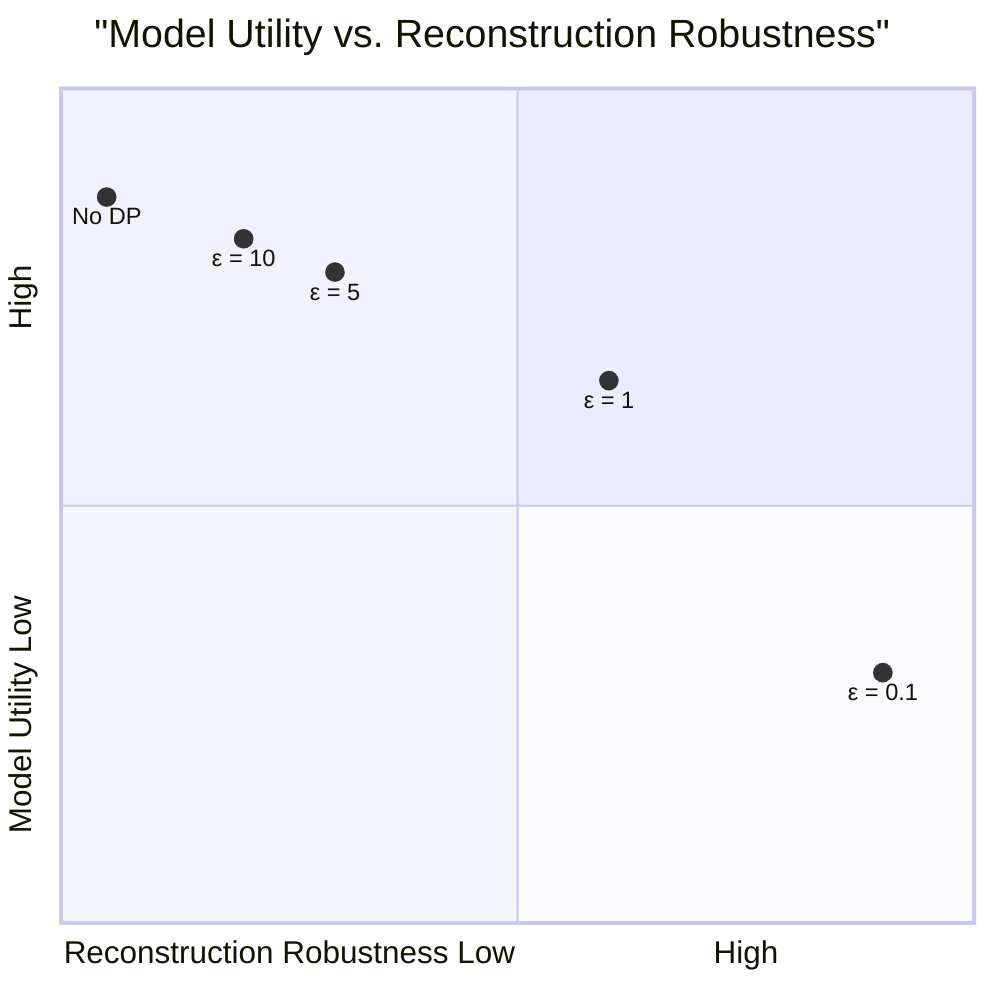

# 📊 Results & Analysis

## 📈 Main Result: Privacy-Utility-Reconstruction Trade-off

> **Key Observation**: For ε ≥ 5, reconstruction error drops below random baseline → **meaningful privacy leakage**.

## 🔍 Statistical Privacy Leak Analysis

| Dataset | ε=0.1 | ε=1 | ε=5 | ε=10 | ε=30 |
|---------|-------|-----|-----|------|------|
| UCI Adult | ❌ 45% | ❌ 18% | ✅ 3% | ✅ 1% | ✅ <1% |
| COMPAS | ❌ 52% | ❌ 22% | ✅ 4% | ✅ 2% | ✅ <1% |

> **Interpretation**: CDF ≤ 5% indicates individual-specific information is leaking.

## ⚖️ The Utility Cliff

> **Critical Finding**: No "sweet spot" where DP forests are both useful AND fully private against this attack.
