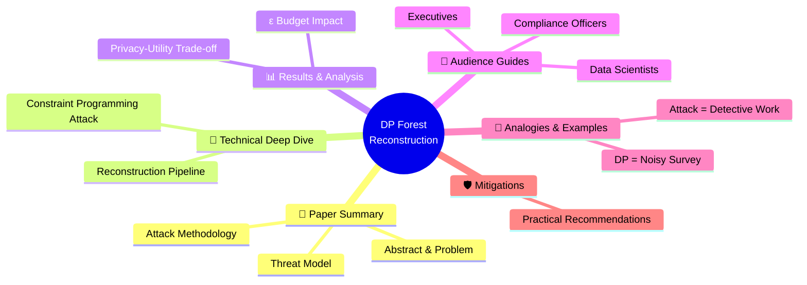

# 🗂️ SaTML-2026 Paper Deep Dive: "Training Set Reconstruction from Differentially Private Forests"

> **Nested Markdown Knowledge Repository**  
> *Paper: "Training Set Reconstruction from Differentially Private Forests: How Effective is DP?"*  
> *Authors: Alice Gorgé, Julien Ferry, Sébastien Gambs, Thibaut Vidal*  
> *Accepted at IEEE SaTML 2026*  
> *Generated: 2026-04-20 21:10*

## 🎯 Paper at a Glance

| Attribute | Details |
|-----------|---------|
| **Title** | Training Set Reconstruction from Differentially Private Forests: How Effective is DP? |
| **Venue** | IEEE SaTML 2026 |
| **Authors** | Gorgé, Ferry, Gambs, Vidal (École Polytechnique, Polytechnique Montréal, UQAM) |
| **Preprint** | [arXiv:2502.05307](https://arxiv.org/abs/2502.05307) |
| **Code** | [GitHub: vidalt/DRAFT-DP](https://github.com/vidalt/DRAFT-DP) |
| **Category** | Research Paper (Group 1) |

## 📋 Core Question
> *"Can differential privacy (DP) truly protect training data in random forests, or can attackers still reconstruct sensitive records?"*

## 🔑 Key Finding
**Random forests trained with meaningful DP guarantees can still leak portions of their training data.** Only forests with predictive performance no better than random guessing are fully robust to reconstruction attacks.

## 🗺️ Repository Structure

## 🚀 Quick Start
- 🎓 **New to DP?** → Start with [🧠 Analogies](./analogies/README.md)
- 🔧 **Implementing RFs?** → Go to [👥 Data Scientists Guide](./audience/data-scientists.md)
- ⚖️ **Assessing compliance?** → See [👥 Compliance Officers Guide](./audience/compliance.md)
- 💼 **Strategic planning?** → Review [👥 Executives Guide](./audience/executives.md)
