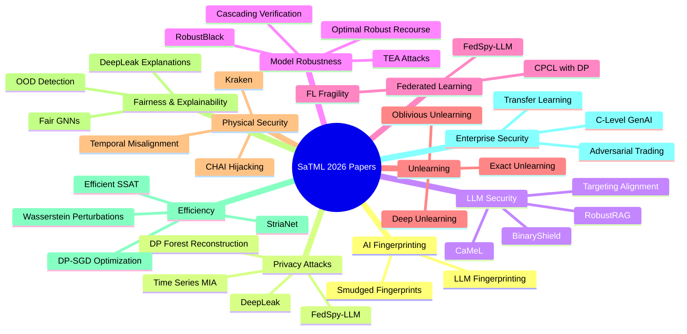

# SaTML 2026 Accepted Papers - Complete Summary

## Accepted Papers Overview

### AI Fingerprinting & Attribution Security
1. **Smudged Fingerprints: A Systematic Evaluation of the Robustness of AI Image Fingerprints**
   - Evaluation of AI image fingerprinting techniques in adversarial settings
   - Reveals significant gaps between clean and adversarial performance
   - Shows fingerprint removal attacks are highly effective (80%+ success rates)

### Privacy Attacks & Membership Inference
2. **Privacy Risks in Time Series Forecasting: User- and Record-Level Membership Inference**
   - Demonstrates vulnerability of forecasting models to membership inference
   - User-level attacks often achieve perfect detection
   - Shows vulnerability increases with prediction horizon and smaller training populations

3. **FedSpy-LLM: Towards Scalable and Generalizable Data Reconstruction Attacks from Gradients on LLMs**
   - Attacks on federated LLMs using gradient decomposition
   - Shows PEFT methods don't sufficiently protect training data
   - Demonstrates scalable reconstruction attacks across diverse architectures

4. **Training Set Reconstruction from Differentially Private Forests: How Effective is DP?**
   - Evaluates differential privacy effectiveness in Random Forests
   - Shows DP still leaks portions of training data
   - Provides practical recommendations for robust DP forest construction

5. **DeepLeak: Privacy Enhancing Hardening of Model Explanations Against Membership Leakage**
   - Addresses privacy risks in post-hoc explanation methods
   - Introduces systematic techniques to reduce membership leakage
   - Demonstrates mitigation strategies for explanation privacy

6. **Membership Inference Attacks for Retrieval Based In-Context Learning for Document Question Answering**
   - Shows privacy risks in retrieval-based in-context learning
   - Demonstrates black-box membership inference attacks
   - Proposes defense mechanisms for the specific setting

### LLM Security & Safety
7. **Certifiably Robust RAG against Retrieval Corruption**
   - First defense framework with certifiable robustness against retrieval corruption
   - Uses "isolate-then-aggregate" strategy for secure aggregation
   - Demonstrates effectiveness across datasets and LLMs

8. **Defeating Prompt Injections by Design**
   - Introduces CaMeL framework to prevent prompt injection attacks
   - Uses control/data flow separation to protect against injections
   - Achieves 67% success in AgentDojo benchmark with provable security

9. **Targeting Alignment: Extracting Safety Classifiers of Aligned LLMs**
   - Demonstrates that alignment techniques embed safety classifiers
   - Shows surrogate classifiers can be extracted and used for attacks
   - Achieves 70% attack success rate with reduced computational cost

10. **BinaryShield: Cross-Service Threat Intelligence in LLM Services using Privacy-Preserving Fingerprints**
   - Privacy-preserving threat intelligence system for LLM services
   - Enables secure sharing of attack fingerprints across compliance boundaries
   - Achieves 0.94 F1-score for attack detection

11. **DataFilter: Data Contamination in Large Language Models**
   - Investigates data contamination in LLM training from external sources
   - Shows presence of data leakage that can affect model behavior
   - Highlights need for better data governance in LLM development

### Model Robustness & Verification
12. **Optimal Robust Recourse with $L^p$-Bounded Model Change**
   - Provides provably optimal robust recourse for generalized linear models
   - Addresses model change constraints measured with Lp norm
   - Achieves significantly lower "price of recourse" than prior work

13. **Cascading Robustness Verification**
   - Multi-scale robustness verification methods
   - Considers cascading effects through model architectures
   - Addresses complex robustness verification challenges

14. **RobustBlack**
   - Black-box robustness testing for machine learning models
   - Evaluates robustness against adversarial inputs
   - Provides practical framework for robustness assessment

15. **TEA: Targeted Adversarial Examples**
   - Targeted adversarial attacks and defenses
   - Analyzes the effectiveness of targeted attacks
   - Provides countermeasures for targeted vulnerabilities

### Federated Learning Security
16. **FedSpy-LLM: Towards Scalable and Generalizable Data Reconstruction Attacks from Gradients on LLMs**
   - Attack framework for federated LLMs using gradient analysis
   - Shows PEFT methods are vulnerable to reconstruction attacks
   - Demonstrates scalability in attack methodology

17. **On the Fragility of Contribution Evaluation in Federated Learning**
   - Shows contribution scoring can be significantly distorted
   - Examines both architectural sensitivity and intentional manipulation
   - Demonstrates impact of poisoning attacks on contribution evaluation

18. **CPCL with DP: Constrained Private Collaborative Learning**
   - Privacy-preserving collaborative learning techniques
   - Addresses constraints in collaborative learning scenarios
   - Provides methods for secure collaborative training

### Model Unlearning & Privacy
19. **Evaluating Deep Unlearning in Large Language Models**
   - Introduces concept of "deep unlearning" in LLMs
   - Addresses both direct and deductive fact removal
   - Shows need for targeted algorithms for robust unlearning

20. **Exact Unlearning of Finetuning Data via Model Merging at Scale**
   - SIFT-Masks for one-shot finetuning and model merging
   - Enables exact unlearning at scale with reduced compute
   - Works with up to 2,500 models for merging

21. **Gauss-Newton Unlearning**
   - Second-order methods for model unlearning
   - Uses Gauss-Newton approximations for computational efficiency
   - Provides scalable unlearning approach

22. **Oblivious Exact (Un)Learning of Extremely Randomized Trees**
   - Encrypted exact unlearning framework
   - Supports oblivious deletion that hides unlearning occurrence
   - Implements within TFHE framework

### Physical & Systems Security
23. **Kraken: Higher-order EM side-channel attacks on DNNs in near and far field**
   - EM side-channel attacks on DNNs including LLMs
   - Demonstrates attacks from distances up to 100 cm
   - Shows model weights can be stolen through electromagnetic radiation

24. **Temporal Misalignment Attacks**
   - Time-based vulnerabilities in ML systems
   - Exploits temporal misalignments for security breaches
   - Analyzes temporal aspects of ML system security

25. **CHAI: Embodied AI Hijacking**
   - Embodied AI systems hacking vulnerabilities
   - Addresses physical hijacking of AI systems in real environments
   - Analyses threats to AI systems in physical environments

### Fairness & Explainability
26. **Homophily-aware Supervised Contrastive Counterfactual Augmented Fair Graph Neural Network**
   - Fair GNN training with homophily awareness
   - Uses contrastive loss and environmental loss for fair training
   - Improves both classification accuracy and fairness metrics

27. **DeepLeak: Privacy Enhancing Hardening of Model Explanations Against Membership Leakage**
   - Addresses privacy in model explanations
   - Introduces mitigations for privacy risks in explanations
   - Demonstrates reduction in leakage with minimal utility loss

28. **Near-OOD Detection: Out-of-distribution Detection Methods**
   - Methods for detecting out-of-distribution inputs
   - Addresses robustness against input variations
   - Provides techniques for identifying inputs outside training distribution

### Efficiency & Optimization
29. **Efficient and Scalable Implementation of Differentially Private Deep Learning without Shortcuts**
   - Efficient DP-SGD implementations with correct Poisson subsampling
   - Demonstrates computational cost reduction through optimization
   - Shows DP-SGD scales better than SGD with larger hardware setups

30. **Towards Zero Rotation and Beyond: Architecting Neural Networks for Fast Secure Inference with Homomorphic Encryption**
   - Network architectures tailored for homomorphic encryption
   - Eliminates external rotation operations
   - Achieves significant speedups in secure inference

31. **Wasserstein-Constrained Data Perturbations**
   - Global explainability framework using Wasserstein metrics
   - Applies optimal transport and distributionally robust optimization
   - Provides theoretical guarantees for explainability analysis

32. **Efficient Semi-Supervised Adversarial Training via Latent Clustering-Based Data Reduction**
   - Reduces data requirements for adversarial training
   - Uses latent clustering to select critical training samples
   - Achieves similar robustness with 5-10x less unlabeled data

### Enterprise AI Security
33. **Adversarial News and Lost Profits: Manipulating Headlines in LLM-Driven Algorithmic Trading**
   - Threats to LLM-driven trading systems using adversarial news
   - Demonstrates impact on financial returns with 17.7 percentage point reduction
   - Addresses real-world feasibility of adversarial attacks

34. **"Org-Wide, We're Not Ready": C-Level Lessons on Securing Generative AI Systems**
   - Empirical study of CISO perspectives on GenAI security
   - Identifies key exposure areas (data movement, prompt misuse, deepfakes)
   - Provides actionable controls for organizational readiness

35. **Reconstructing Training Data from Models Trained with Transfer Learning**
   - Privacy risks in transfer learning scenarios
   - Shows data leakage in transfer learning processes
   - Addresses security implications of data reuse in ML systems

## Multi-Stakeholder Perspectives

### Data Scientists
- **Technical Focus**: New attack/defense methodologies and implementation details
- **Evaluation Metrics**: Performance benchmarks and experimental validation
- **Novel Approaches**: Mathematical frameworks for robustness and explainability
- **Comparative Analysis**: Multi-dataset, multi-model testing approaches

### Compliance Officers
- **Regulatory Alignment**: GDPR, AI Act, and privacy regulation concerns
- **Privacy Budgets**: Differential privacy mechanisms and implementation
- **Certification Requirements**: Formal verification and certified approaches
- **Data Governance**: Data handling protocols and accountability measures

### Executives
- **Business Risk**: Strategic assessment of AI security vulnerabilities
- **ROI Considerations**: Cost-benefit analysis of security investments
- **Market Position**: Competitive advantages and competitive threats
- **Governance Frameworks**: Organizational readiness for AI deployment

## Key Takeaways

1. **Security Vulnerabilities Are Widespread**: Across multiple ML domains, significant security gaps threaten privacy and data integrity

2. **Privacy in ML Systems**: Federated learning, differential privacy, and data reconstruction attacks show continuing challenges

3. **LLM Security Concerns**: Even aligned LLMs can be compromised through classifier extraction techniques

4. **Physical Security Matters**: Traditional network-centric thinking is insufficient - physical side-channel attacks pose real threats

5. **Scalability of Security Approaches**: Efficient approaches for privacy-preserving ML are possible with proper implementation

6. **Need for New Paradigms**: Current approaches need to evolve to address complexity of modern ML systems

## Research Directions

The accepted papers indicate several promising research areas:
- Development of robust, certifiable security frameworks
- Improved privacy-preserving techniques for all ML domains
- Better understanding of model vulnerabilities across architectures
- Integration of security into ML system design from the ground up
- Cross-domain security analysis and transfer of techniques

## Conclusion

SaTML 2026 has provided a critical assessment of security and privacy challenges in modern ML systems. The research demonstrates both the vulnerabilities in current approaches and promising paths forward for developing more robust, secure, and privacy-preserving AI technologies.

The papers collectively illustrate that AI security must address multiple dimensions: algorithmic robustness, privacy considerations, physical security threats, and organizational readiness. The field needs integrated approaches combining technical methods with organizational security strategies to meet growing challenges in AI adoption.

