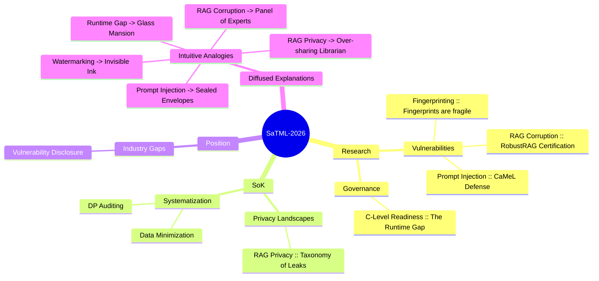

# 🗺️ SaTML-2026 Knowledge Mindmap

This document serves as the central navigational hub for the accepted papers of SaTML-2026. It maps the relationships between technical research, systematized knowledge, and intuitive explanations.

## 🧠 Global Mindmap

## 🔗 Navigation Guide

### 🔬 Technical Deep-Dives (`/research`)
For those who need the **"How"** and the **"Metrics"**.
- **[Smudged Fingerprints](./research/smudged-fingerprints.md)** $\rightarrow$ *Detailed analysis of attribution fragility.*
- **[RobustRAG](./research/robust-rag.md)** $\rightarrow$ *Certification logic for RAG defenses.*
- **[CaMeL Defense](./research/prompt-injection-design.md)** $\rightarrow$ *System-level separation of control and data.*
- **[Enterprise Readiness](./research/clevel-genai.md)** $\rightarrow$ *C-level analysis of the "Runtime Gap".*

### 📖 Systematized Knowledge (`/sok`)
For those who need the **"Landscape"** and the **"Taxonomy"**.
- **[RAG Privacy](./sok/rag-privacy.md)** $\rightarrow$ *Comprehensive overview of privacy leakage in retrieval.*

### 💡 Diffused Explanations (`/research/` & `/sok/`)
For those who need the **"What does this mean for me?"** in plain English.
- **[Watermarking Analogy](./research/00-smudged-fingerprints-diffused-explanation.md)**
- **[RAG Defense Analogy](./research/00-robust-rag-diffused-explanation.md)**
- **[Prompt Injection Analogy](./research/00-prompt-injection-design-diffused-explanation.md)**
- **[Runtime Gap Analogy](./research/00-clevel-genai.md)** $\rightarrow$ *(Refer to 00-clevel-genai-diffused-explanation.md)*
- **[RAG Privacy Analogy](./sok/00-rag-privacy-diffused-explanation.md)**

## 👥 Audience Matrix

| Target Group | Recommended Path | Primary Focus |
| :--- | :--- | :--- |
| **Data Scientists** | `Research` $\rightarrow$ `Technical Notes` | Algorithms, Certifications, Metrics |
| **Compliance Officers** | `SoK` $\rightarrow$ `Research` | Regulatory risks, Privacy budgets, Certification |
| **Executives** | `Diffused` $\rightarrow$ `Mindmap` | Business Risk, Resource Allocation, Strategic gaps |
