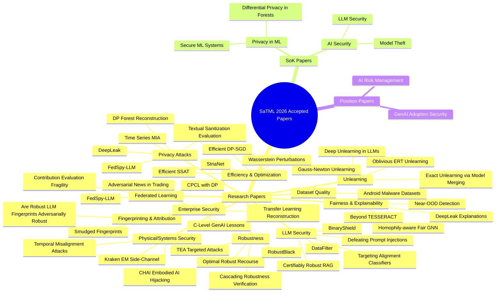

# SaTML 2026 Accepted Papers - Comprehensive Mindmap

```mermaid
mindmap
  root((SaTML 2026 Accepted Papers))
    Research Papers
      Fingerprinting & Attribution
        Smudged Fingerprints
        Are Robust LLM Fingerprints Adversarially Robust
      Privacy Attacks
        Time Series MIA
        FedSpy-LLM
        DP Forest Reconstruction
        DeepLeak
        Textual Sanitization Evaluation
      LLM Security
        Certifiably Robust RAG
        Defeating Prompt Injections
        Targeting Alignment Classifiers
        BinaryShield
        DataFilter
      Robustness
        Optimal Robust Recourse
        Cascading Robustness Verification
        RobustBlack
        TEA Targeted Attacks
      Federated Learning
        FedSpy-LLM
        Contribution Evaluation Fragility
        CPCL with DP
      Unlearning
        Deep Unlearning in LLMs
        Exact Unlearning via Model Merging
        Gauss-Newton Unlearning
        Oblivious ERT Unlearning
      Physical/Systems Security
        Kraken EM Side-Channel
        Temporal Misalignment Attacks
        CHAI Embodied AI Hijacking
      Fairness & Explainability
        Homophily-aware Fair GNN
        DeepLeak Explanations
        Near-OOD Detection
      Efficiency & Optimization
        Efficient DP-SGD
        StriaNet
        Wasserstein Perturbations
        Efficient SSAT
      Enterprise Security
        Adversarial News in Trading
        C-Level GenAI Lessons
        Transfer Learning Reconstruction
      Dataset Quality
        Android Malware Datasets
        Beyond TESSERACT
    SoK Papers
      Privacy in ML
        Differential Privacy in Forests
        Secure ML Systems
      AI Security
        LLM Security
        Model Theft
    Position Papers
      GenAI Adoption Security
      AI Risk Management
```