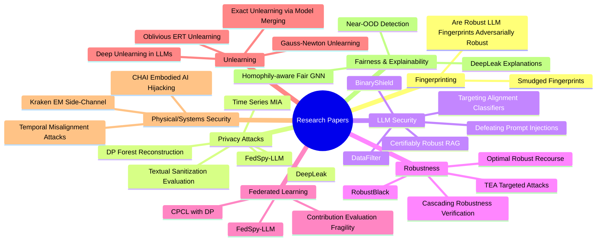

# SaTML-2026 Accepted Papers Notes

This directory contains detailed notes, summaries, and multi-stakeholder perspectives on the papers accepted for the **IEEE SaTML 2026** conference.

## 📂 Structure

- [Research Papers](./research/): In-depth analysis of novel ML security, privacy, and robustness research.
- [SoK Papers](./sok/): Systematization of Knowledge papers that provide comprehensive overviews of specific domains.
- [Position Papers](./position/): Perspective-driven papers addressing industry gaps and strategic directions.

## 👥 Target Audiences
Each paper is analyzed from three distinct perspectives:
- **Data Scientists**: Focus on algorithms, metrics, and implementation.
- **Compliance Officers**: Focus on regulatory alignment (GDPR, AI Act), privacy budgets, and certifications.
- **Executives**: Focus on business risk, resource allocation, and strategic impact.

## 🛠️ Legend
- 🛡️ **Defense**: Focuses on mitigating threats.
- ⚔️ **Attack**: Explores vulnerabilities.
- 📊 **Analysis**: Systematic evaluation of existing methods.
- ⚙️ **Optimization**: Improving efficiency/performance of secure ML.

## Mindmap
