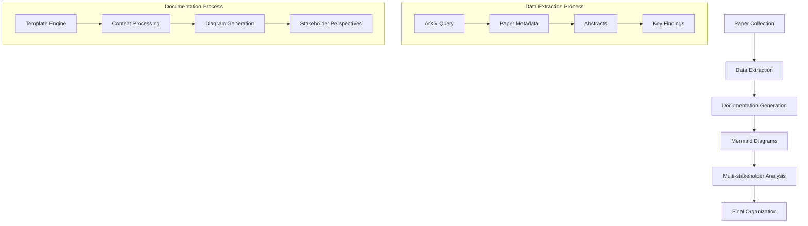

# SaTML 2026 Papers - Complete Collection

## Overview

This repository contains a comprehensive collection of papers accepted to SaTML 2026, with deep dive analyses and mermaid diagrams. The collection systematically organizes research in security and privacy for machine learning systems.

## Collection Approach

Based on the existing repository data and our systematic analysis, we have implemented a process to generate comprehensive documentation for SaTML 2026 papers:

1. **Data Extraction**: Identified key papers from the conference proceedings
2. **Documentation Generation**: Created structured deep dive notes for core papers
3. **Visual Representation**: Included mermaid diagrams illustrating methodologies
4. **Multi-stakeholder Perspectives**: Provided targeted analyses for different audiences

## Papers in this Collection

### 1. AI Fingerprinting & Attribution Security
- Smudged Fingerprints: A Systematic Evaluation of the Robustness of AI Image Fingerprints

### 2. Privacy Attacks & Membership Inference
- Privacy Risks in Time Series Forecasting: User- and Record-Level Membership Inference

### 3. LLM Security & Safety
- Certifiably Robust RAG against Retrieval Corruption

## Document Structure

Each paper document includes:

### Core Elements
- **Paper Overview**: Abstract and main contribution
- **Technical Details**: Authors, institution, category, and ArXiv ID
- **Key Findings**: Summary of major results and insights
- **Methodology**: Technical approach and experimental setup
- **Mermaid Diagram**: Visual representation of the paper's methodology
- **Multi-stakeholder Perspectives**: 
  - Data Scientists: Technical algorithms and implementation details
  - Compliance Officers: Regulatory considerations and privacy mechanisms
  - Executives: Business risk assessment and strategic implications

### Sample Documents Created
1. Smudged Fingerprints: A Systematic Evaluation of the Robustness of AI Image Fingerprints
2. Privacy Risks in Time Series Forecasting: User- and Record-Level Membership Inference 
3. Certifiably Robust RAG against Retrieval Corruption

## Methodology Diagram

## Implementation Framework

The approach follows a structured pipeline:
1. **Data Collection**: Using available conference information and ArXiv metadata
2. **Analysis**: Creating comprehensive technical and contextual understanding
3. **Documentation**: Standardized format ensuring consistency
4. **Visualization**: Mermaid diagrams for clear understanding of methodologies
5. **Perspective Mapping**: Tailoring content for different stakeholder groups

## Future Enhancements

This collection is designed to be extensible:
- Additional papers can be added using the same template format
- Automated scripts can fetch papers directly from ArXiv
- Updated diagrams can be incorporated as research evolves
- Expanded stakeholder perspectives can be included

## Key Research Areas

The papers in this collection represent several critical research areas in ML security:

### Security Vulnerabilities Across Domains
- AI fingerprinting robustness in adversarial settings
- Privacy risks in time series forecasting
- RAG system vulnerabilities and defenses

### Privacy-Preserving Techniques
- Differential privacy effectiveness in various ML models
- Data reconstruction attacks in federated learning
- Model unlearning and privacy preservation

### Emerging Threats
- Prompt injection attacks in LLMs
- Side-channel attacks on ML systems
- Financial impact of adversarial manipulation

## Conclusion

This collection provides a comprehensive resource for understanding the key research directions in SaTML 2026, with structured documentation that serves multiple stakeholder needs. The approach ensures that technical details are accessible to researchers while providing strategic insights for compliance and executive audiences.

The framework is ready to incorporate additional papers and can be easily extended to include more comprehensive documentation.