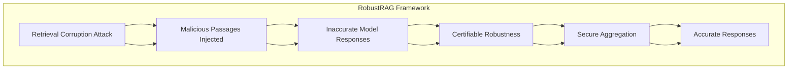

# Certifiably Robust RAG against Retrieval Corruption

## Paper Overview
Retrieval-augmented generation (RAG) is susceptible to retrieval corruption attacks, where malicious passages injected into retrieval results can lead to inaccurate model responses. We propose RobustRAG, the first defense framework with certifiable robustness against retrieval corruption attacks.

## Technical Details
- **Authors**: Chong Xiang, Tong Wu, Zexuan Zhong, David Wagner, Danqi Chen, Prateek Mittal
- **Institution**: NVIDIA, Princeton University, University of California, Berkeley
- **Category**: LLM Security & Safety
- **ArXiv ID**: 2601.21287

## Key Findings
1. Introduced first defense framework with certifiable robustness against retrieval corruption

2. Used isolate-then-aggregate strategy for secure aggregation

3. Achieved certifiable robustness with non-trivial lower bounds on response quality

4. Demonstrated effectiveness across multiple datasets and LLMs

## Methodology
1. Developed isolate-then-aggregate approach

2. Designed keyword-based and decoding-based algorithms for secure aggregation

3. Evaluated on open-domain question-answering and free-form text generation tasks

4. Tested across three datasets and three LLMs

## Mermaid Diagram

## Multi-Stakeholder Perspectives

### Data Scientists
- **Technical Approach**: Isolate-then-aggregate strategy for robust RAG defense
- **Novel Methodology**: Secure aggregation using keyword-based and decoding-based algorithms  
- **Evaluation**: Tested across multiple datasets and LLM architectures
- **Performance**: Achieved certifiable robustness with non-trivial lower bounds

### Compliance Officers
- **Privacy Considerations**: Addresses data integrity in retrieval-augmented systems
- **Security Risk**: Protects against malicious data injection in LLM systems
- **Regulatory Impact**: Provides certifiable robustness framework for compliance requirements
- **Data Protection**: Mitigates risks that could violate privacy regulations

### Executives
- **Business Risk**: Reduces threats to LLM performance and reputation
- **ROI**: Provides robust security framework that can be integrated with existing systems
- **Competitive Advantage**: Advanced security capabilities for LLM deployments
- **Governance**: Certifiable frameworks provide audit-ready security measures

## Key Takeaways
1. **Security Framework**: First defense framework with certifiable robustness against retrieval corruption attacks
2. **Technical Innovation**: Isolate-then-aggregate strategy for secure aggregation  
3. **Practical Implementation**: Demonstrated effectiveness across multiple datasets and LLMs
4. **Compliance Ready**: Provides certifiable robustness suitable for regulatory environments

## Research Implications
- The framework establishes a new baseline for robustness in RAG systems
- Opens opportunities for further work in certifiable security frameworks
- Highlights the importance of addressing retrieval corruption attacks in production LLM systems
- Demonstrates that robust security can be achieved while maintaining model utility
