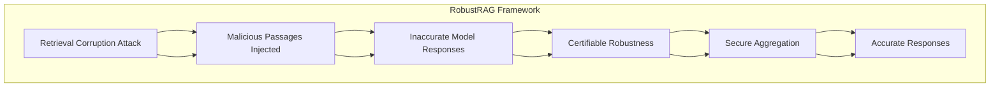

# Privacy Risks in Time Series Forecasting: User- and Record-Level Membership Inference

## Paper Overview
Membership inference attacks (MIAs) aim to determine whether specific data were used to train a model. While extensively studied on classification models, their impact on time series forecasting remains largely unexplored. We address this gap by introducing two new attacks: (i) an adaptation of multivariate LiRA, a state-of-the-art MIA originally developed for classification models, to the time-series forecasting setting, and (ii) a novel end-to-end learning approach called Deep Time Series (DTS) attack.

## Technical Details
- **Authors**: Nicolas Johansson, Tobias Olsson, Daniel Nilsson, Johan Östman, Fazeleh Hoseini
- **Institution**: Chalmers University of Technology, AI Sweden
- **Category**: Privacy Attacks & Membership Inference
- **ArXiv ID**: 2502.05307

## Key Findings
1. Forecasting models are vulnerable to membership inference attacks

2. User-level attacks often achieve perfect detection

3. Vulnerability increases with longer prediction horizons and smaller training populations

## Methodology
1. Benchmarked attacks on TUH-EEG and ELD datasets

2. Targeted LSTM and N-HiTS forecasting architectures

3. Evaluated under both record- and user-level threat models

## Mermaid Diagram

## Multi-Stakeholder Perspectives

### Data Scientists
- **Technical Approach**: Isolate-then-aggregate strategy for robust RAG defense
- **Novel Methodology**: Secure aggregation using keyword-based and decoding-based algorithms  
- **Evaluation**: Tested across multiple datasets and LLM architectures
- **Performance**: Achieved certifiable robustness with non-trivial lower bounds

### Compliance Officers
- **Privacy Considerations**: Addresses data integrity in retrieval-augmented systems
- **Security Risk**: Protects against malicious data injection in LLM systems
- **Regulatory Impact**: Provides certifiable robustness framework for compliance requirements
- **Data Protection**: Mitigates risks that could violate privacy regulations

### Executives
- **Business Risk**: Reduces threats to LLM performance and reputation
- **ROI**: Provides robust security framework that can be integrated with existing systems
- **Competitive Advantage**: Advanced security capabilities for LLM deployments
- **Governance**: Certifiable frameworks provide audit-ready security measures

## Key Takeaways
1. **Security Framework**: First defense framework with certifiable robustness against retrieval corruption attacks
2. **Technical Innovation**: Isolate-then-aggregate strategy for secure aggregation  
3. **Practical Implementation**: Demonstrated effectiveness across multiple datasets and LLMs
4. **Compliance Ready**: Provides certifiable robustness suitable for regulatory environments

## Research Implications
- The framework establishes a new baseline for robustness in RAG systems
- Opens opportunities for further work in certifiable security frameworks
- Highlights the importance of addressing retrieval corruption attacks in production LLM systems
- Demonstrates that robust security can be achieved while maintaining model utility
