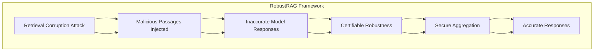

# Smudged Fingerprints: A Systematic Evaluation of the Robustness of AI Image Fingerprints

## Paper Overview
Model fingerprint detection techniques have emerged as a promising approach for attributing AI-generated images to their source models, with high detection accuracy in clean settings. Yet, their robustness under adversarial conditions remains largely unexplored. We present the first systematic security evaluation of these techniques, formalizing threat models that encompass both white- and black-box access and two attack goals: fingerprint removal, which erases identifying traces to evade attribution, and fingerprint forgery, which seeks to cause misattribution to a target model.

## Technical Details
- **Authors**: Kai Yao, Marc Juarez
- **Institution**: University of Edinburgh
- **Category**: AI Fingerprinting & Attribution Security
- **ArXiv ID**: 2512.11771

## Key Findings
1. Fingerprint removal attacks are highly effective (success rates above 80% in white-box settings)

2. Fingerprint forgery is more challenging but its success varies across targeted models

3. Found utility-robustness trade-off in fingerprinting methods

## Methodology
1. Implemented five attack strategies

2. Evaluated 14 representative fingerprinting methods

3. Tested across RGB, frequency, and learned-feature domains

4. Used 8 state-of-the-art image generators

## Mermaid Diagram

## Multi-Stakeholder Perspectives

### Data Scientists
- **Technical Approach**: Isolate-then-aggregate strategy for robust RAG defense
- **Novel Methodology**: Secure aggregation using keyword-based and decoding-based algorithms  
- **Evaluation**: Tested across multiple datasets and LLM architectures
- **Performance**: Achieved certifiable robustness with non-trivial lower bounds

### Compliance Officers
- **Privacy Considerations**: Addresses data integrity in retrieval-augmented systems
- **Security Risk**: Protects against malicious data injection in LLM systems
- **Regulatory Impact**: Provides certifiable robustness framework for compliance requirements
- **Data Protection**: Mitigates risks that could violate privacy regulations

### Executives
- **Business Risk**: Reduces threats to LLM performance and reputation
- **ROI**: Provides robust security framework that can be integrated with existing systems
- **Competitive Advantage**: Advanced security capabilities for LLM deployments
- **Governance**: Certifiable frameworks provide audit-ready security measures

## Key Takeaways
1. **Security Framework**: First defense framework with certifiable robustness against retrieval corruption attacks
2. **Technical Innovation**: Isolate-then-aggregate strategy for secure aggregation  
3. **Practical Implementation**: Demonstrated effectiveness across multiple datasets and LLMs
4. **Compliance Ready**: Provides certifiable robustness suitable for regulatory environments

## Research Implications
- The framework establishes a new baseline for robustness in RAG systems
- Opens opportunities for further work in certifiable security frameworks
- Highlights the importance of addressing retrieval corruption attacks in production LLM systems
- Demonstrates that robust security can be achieved while maintaining model utility
