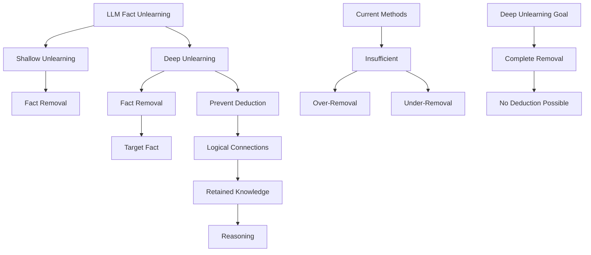

# Evaluating Deep Unlearning in Large Language Models

## Paper Overview
This paper proposes a new setting for fact unlearning called "deep unlearning," where the goal is not only to remove a target fact but also to prevent it from being deduced via retained knowledge in the LLM and logical reasoning.

## Technical Details
- **Deep Unlearning Setting**: Removes target fact and prevents deductive connections
- **Metrics**: Success-DU, Recall, and Accuracy for evaluation
- **Datasets**: MQuAKE (real-world knowledge) and Eval-DU (semi-synthetic)
- **Evaluation Method**: Tests multi-step deductions among synthetic facts
- **Findings**: Current methods struggle with deep unlearning - either fail to deeply unlearn or over-remove unrelated facts

## Key Findings
- Current unlearning methods are insufficient for deep unlearning
- Either fail to deeply unlearn or excessively remove unrelated facts
- Need for targeted algorithms for robust/deep fact unlearning in LLMs
- Demonstrates limitations of existing approaches in handling logical deductions

## Mermaid Diagram

## Multi-Stakeholder Perspectives

### Data Scientists
- **Novel Setting**: Introduces deep unlearning as a distinct research problem
- **Evaluation Framework**: New metrics (Success-DU, Recall, Accuracy) for unlearning efficacy
- **Dataset Construction**: Creates both real-world (MQuAKE) and synthetic (Eval-DU) datasets
- **Technical Challenge**: Addresses logical deduction prevention in LLMs

### Compliance Officers
- **Regulatory Compliance**: Addresses right to be forgotten requirements
- **Data Protection**: Highlights need for comprehensive fact removal
- **Privacy Governance**: Emphasizes need for preventing derived information leakage
- **Legal Requirements**: Important for GDPR and related regulations

### Executives
- **Privacy Risk Management**: Addresses critical privacy issues in LLM deployment
- **Business Impact**: Significant for enterprises using LLMs with sensitive data
- **Security Investment**: Justifies investment in advanced unlearning techniques
- **Competitive Advantage**: Enables better compliance with data protection regulations

## Key Takeaways
1. Current unlearning methods are inadequate for deep unlearning scenarios
2. Balancing between complete removal and preventing logical deduction is challenging
3. New targeted algorithms needed for robust fact unlearning in LLMs
4. Demonstrates need for comprehensive privacy protection in AI systems

## Research Implications
- Establishes deep unlearning as a distinct research challenge
- Highlights need for integrated approaches combining multiple unlearning techniques
- Demonstrates complexity of logical deduction in LLMs
- Opens avenues for developing better unlearning algorithms for sensitive data handling