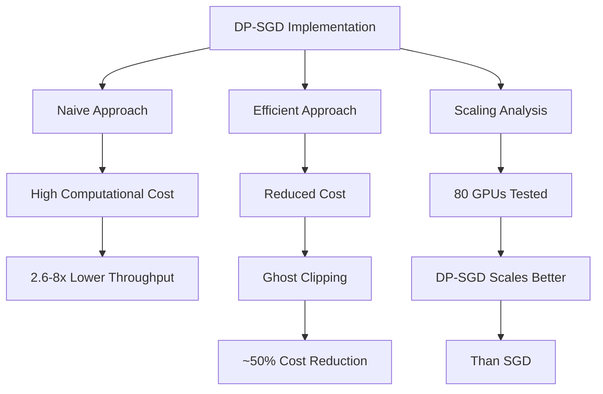

# Efficient and Scalable Implementation of Differentially Private Deep Learning without Shortcuts

## Paper Overview
This paper addresses the computational inefficiency of differentially private stochastic gradient descent (DP-SGD) implementations that rely on shortcuts to achieve faster processing times by using faster but incorrect subsampling methods.

## Technical Details
- **Problem**: Naive DP-SGD implementations have 2.6-8x lower throughput than SGD
- **Solution**: Implement efficient DP-SGD with correct Poisson subsampling
- **Efficient Gradient Clipping**: Ghost Clipping method reduces cost by ~50%
- **Implementation**: Alternative method using JAX with Poisson subsampling
- **Scaling**: Tested with up to 80 GPUs showing better DP-SGD scaling than SGD

## Key Findings
- Correct Poisson subsampling significantly impacts performance
- Efficient implementations can reduce the computational cost of DP-SGD
- Ghost Clipping approach reduces computational cost effectively
- DP-SGD scales better than SGD with larger GPU counts

## Mermaid Diagram

## Multi-Stakeholder Perspectives

### Data Scientists
- **Technical Implementation**: Provides detailed analysis of DP-SGD implementations
- **Computational Efficiency**: Shows performance metrics and computational cost analysis
- **Optimization Techniques**: Introduces Ghost Clipping and alternative JAX implementations
- **Benchmarking**: Extensive empirical testing with 80 GPUs

### Compliance Officers
- **Privacy Implementation**: Provides practical guidance for DP implementation
- **Computational Requirements**: Addresses resource allocation for privacy-preserving systems
- **Compliance Readiness**: Efficient implementations enable better compliance
- **Privacy Budget**: Shows practical trade-offs between privacy and computational costs

### Executives
- **Resource Allocation**: Demonstrates efficient use of computing resources
- **Cost Effectiveness**: Shows methods to reduce computational costs
- **Scalability**: Addresses scaling challenges in privacy-preserving AI systems
- **Investment ROI**: Practical implementations that reduce implementation costs

## Key Takeaways
1. Naive DP-SGD implementations are computationally inefficient
2. Correct Poisson subsampling is crucial for theoretical guarantees
3. Efficient gradient clipping approaches significantly reduce computational cost
4. DP systems can scale effectively with proper implementation

## Research Implications
- Provides practical implementations for DP-SGD that can be adopted
- Demonstrates importance of correct implementation over performance shortcuts
- Shows scalability improvements with larger GPU setups
- Opens avenues for further optimization of privacy-preserving deep learning