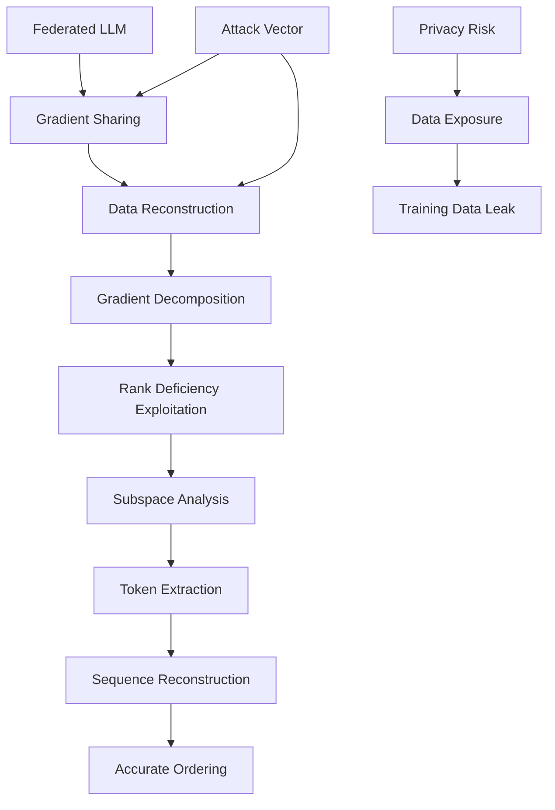

# FedSpy-LLM: Towards Scalable and Generalizable Data Reconstruction Attacks from Gradients on LLMs

## Paper Overview
This paper presents FedSpy-LLM, a scalable and generalizable data reconstruction attack designed to reconstruct training data from gradients in federated LLMs. The approach targets PEFT methods and addresses limitations of prior attacks on full-parameter model training.

## Technical Details
- **Attack Method**: Gradient decomposition strategy exploiting rank deficiency and subspace structure
- **Scalability**: Handles larger batch sizes and longer sequences
- **Generalization**: Works across diverse model architectures (encoder-based, decoder-based, encoder-decoder)
- **PEFT Handling**: Addresses challenges introduced by PEFT's substantial null space
- **Token Ordering**: Iteratively aligns partial-sequence gradients with full-sequence gradients

## Key Findings
- FedSpy-LLM outperforms prior attacks in realistic settings
- Maintains strong reconstruction quality across challenging scenarios
- Reveals broader and more severe privacy risk landscape in federated LLMs
- Demonstrates that PEFT methods don't prevent data reconstruction

## Mermaid Diagram

## Multi-Stakeholder Perspectives

### Data Scientists
- **Attack Methodology**: Novel gradient decomposition technique exploiting mathematical properties
- **Implementation**: Addresses limitations of previous attacks on PEFT methods
- **Technical Challenge**: Overcomes rank deficiency and null space issues in PEFT
- **Evaluation**: Extensive empirical validation showing superior performance

### Compliance Officers
- **Privacy Risk Assessment**: Demonstrates significant privacy risks in federated LLMs
- **Regulatory Concerns**: Highlights inadequate protection in current federated learning approaches
- **Data Protection**: Shows that PEFT methods don't sufficiently protect training data
- **Compliance Requirements**: Reinforces need for stronger privacy protections in federated AI

### Executives
- **Security Gap**: Identifies critical security vulnerability in federated LLM deployments
- **Business Impact**: Reveals privacy risks that could affect competitive advantage
- **Investment Needs**: Justifies investment in more robust privacy protection measures
- **Market Position**: Highlights competitive disadvantage from inadequate data protection

## Key Takeaways
1. Significant privacy risks remain in federated LLMs even with PEFT methods
2. Gradient-based data reconstruction is more scalable and generalizable than previous methods
3. PEFT methods do not provide sufficient protection against data reconstruction
4. Attackers can successfully reconstruct training data even in realistic conditions

## Research Implications
- Requires development of better privacy preserving techniques for federated LLMs
- Shows need for new approaches beyond current PEFT methods
- Highlights importance of gradient-based attack analysis
- Opens research in more robust privacy mechanisms for federated AI