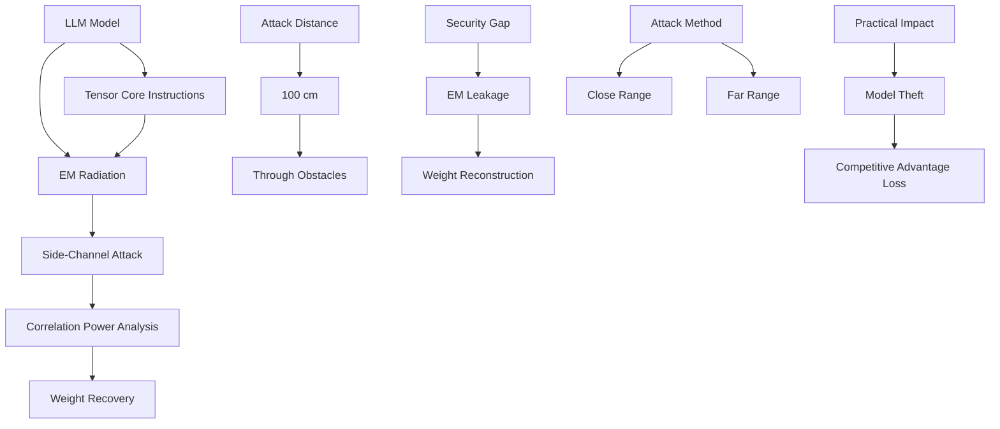

# Kraken: Higher-order EM side-channel attacks on DNNs in near and far field

## Paper Overview
This paper introduces a novel weight extraction attack against Large Language Models (LLMs) implemented with Tensor Core instructions, demonstrating that electromagnetic (EM) radiation contains enough information to eavesdrop on model weights from distances up to 100 cm.

## Technical Details
- **Attack Vector**: Correlation Power Analysis (CPA) to recover model weights
- **Model Target**: LLMs implemented with Tensor Core instructions
- **Distance Range**: From as far as 100 cm with glass obstacle
- **Technique**: EM side-channel attacks for weight extraction
- **Demonstration**: Successfully recovers weights in far-field conditions

## Key Findings
- EM radiation contains sufficient information to steal model weights
- Attack works at distances up to 100 cm through obstacles
- Not all weights need to be recovered to steal the model
- First demonstration of practical weight extraction from LLMs using EM side-channels
- Highlights vulnerability of modern ML model implementations

## Mermaid Diagram

## Multi-Stakeholder Perspectives

### Data Scientists
- **Novel Attack Method**: EM side-channel attacks on neural networks
- **Technical Analysis**: Uses CPA for weight extraction from LLMs
- **Distance Capability**: Demonstrates practical attack range of 100 cm
- **Hardware-Specific**: Focuses on Tensor Core implementations

### Compliance Officers
- **Security Risk**: Critical vulnerability in ML model implementations
- **Intellectual Property**: Highlights IP theft risks from model leakage
- **Regulatory Impact**: Important for data protection and cybersecurity regulations
- **Compliance Challenges**: Addresses need for physical security measures

### Executives
- **Business Risk**: Significant threat to competitive advantage and IP
- **Security Investment**: Need for improved physical security measures
- **Market Impact**: Threatens competitive position of AI platforms
- **Risk Management**: Addresses physical security gaps in ML systems

## Key Takeaways
1. EM side-channel attacks can compromise ML model weights from significant distances
2. Modern implementations using Tensor Cores are vulnerable to physical attacks
3. Attack effectiveness is demonstrated in practical, real-world conditions
4. Even partial weight recovery can be sufficient for model theft

## Research Implications
- Highlights need for physical security in ML environments
- Opens research on EM-resistant model implementations
- Demonstrates vulnerability of modern hardware-specific optimizations
- Shows importance of considering side-channel attacks in ML security