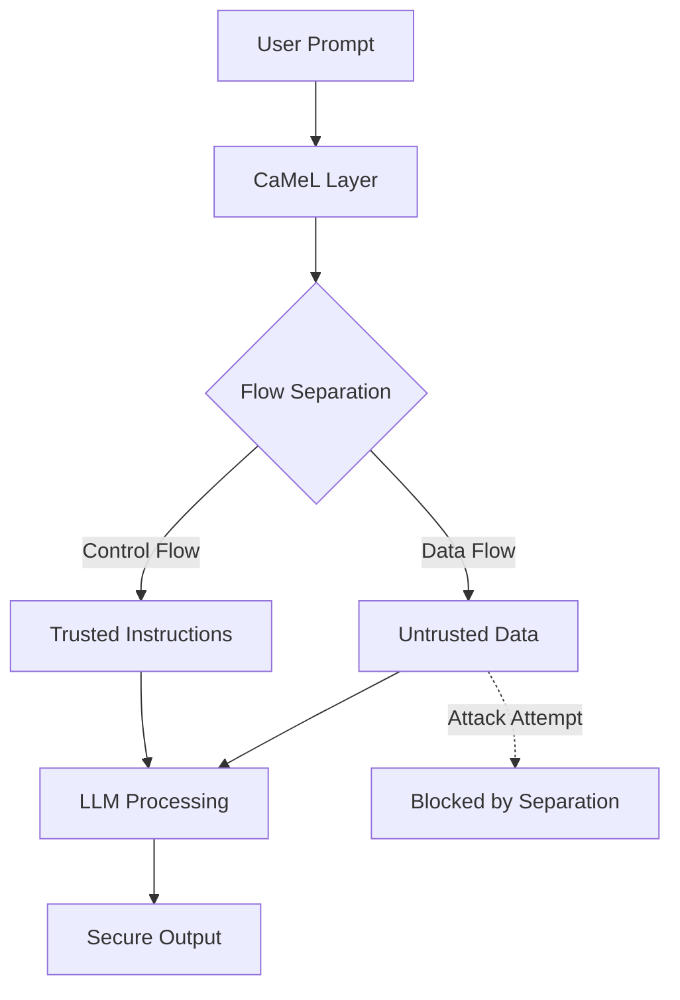

# Defeating Prompt Injections by Design (CaMeL)

## 📝 Summary
The paper introduces **CaMeL**, a architectural defense that creates a protective layer around LLMs to stop prompt injections. It works by strictly separating the control flow (trusted instructions) from the data flow (untrusted retrieved data).

## 📐 Architecture & Workflow

## 👥 Stakeholder Perspectives

### 🧪 Data Scientists
- **Insight**: Instead of trying to "train out" prompt injection (which is like a game of whack-a-mole), this approach uses system-level constraints to make injection theoretically impossible.
- **Performance**: Solved 67% of AgentDojo tasks with provable security.

### ⚖️ Compliance Officers
- **Insight**: Provides a "provable security" guarantee, which is a key requirement for moving from "experimental" to "production" AI in high-risk environments.

### 📈 Executives
- **Insight**: Reduces the reliance on fragile prompt-engineering filters and focuses on a structural fix, lowering the long-term maintenance cost of AI security.
