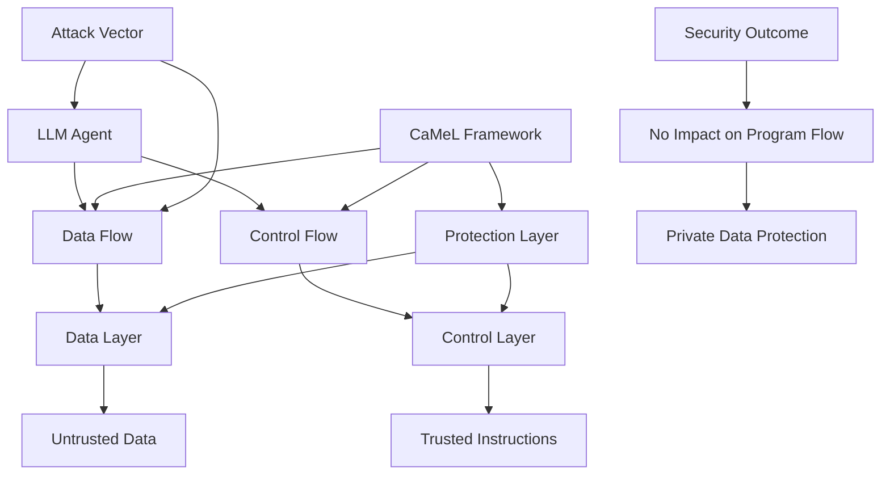

# Defeating Prompt Injections by Design (CaMeL)

## Paper Overview
This paper introduces CaMeL, a robust defense that creates a protective system layer around LLMs to prevent prompt injection attacks. The approach separates control flow from data flow explicitly, making untrusted data incapable of impacting program flow.

## Technical Details
- **Architecture**: Protective system layer around LLMs
- **Control/Data Separation**: Explicitly extracts control and data flows
- **Capability System**: Prevents exfiltration of private data over unauthorized data flows
- **Security Benchmark**: Solves 67% of tasks with provable security in AgentDojo

## Key Findings
- CaMeL successfully defends against prompt injection attacks by separating control from data
- Achieves provable security in agentic systems
- Solves 67% of AgentDojo tasks with guaranteed security properties
- Demonstrated effectiveness in real-world agentic security scenarios

## Mermaid Diagram

## Multi-Stakeholder Perspectives

### Data Scientists
- **Defense Mechanism**: Novel architectural defense approach using control/data flow separation
- **Implementation**: Systematic methodology for designing robust LLM systems
- **Evaluation Metrics**: Achieves 67% success rate on AgentDojo benchmark
- **Security Model**: Capability-based protection against data exfiltration

### Compliance Officers
- **Regulatory Compliance**: Provides mechanism for protecting sensitive data in AI systems
- **Security Assurance**: Provable security properties satisfy privacy requirements
- **Audit Readiness**: Verifiable defense framework supports compliance audits
- **Data Governance**: Addresses data flow management for regulatory compliance

### Executives
- **Risk Reduction**: Significant security improvements in LLM deployment
- **Operational Security**: Robust defense against prompt injection attacks
- **Investment Justification**: Provable security provides ROI assurance
- **Competitive Positioning**: Enhanced security strengthens AI platform offerings

## Key Takeaways
1. Control/data flow separation prevents prompt injection attacks
2. Provable security provides confidence in defense framework
3. Effective against real-world agentic security challenges
4. Demonstrated performance in industry benchmark evaluations

## Research Implications
- Establishes new design pattern for secure LLM systems
- Demonstrates practical application of formal security methods
- Highlights architectural approach to AI security challenges
- Opens avenues for defense mechanisms in other AI systems