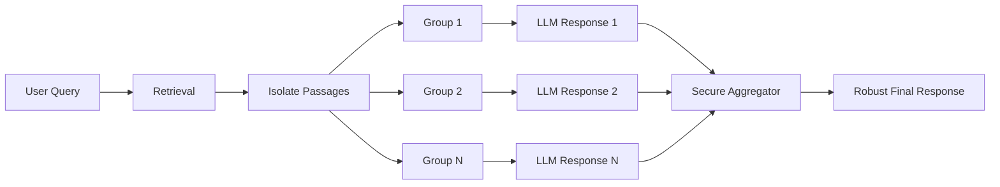

# RobustRAG: Certifiably Robust RAG against Retrieval Corruption

## 📝 Summary
RobustRAG is a defense framework designed to prevent "retrieval corruption," where a malicious document injected into the RAG retrieval set forces the LLM to give a wrong answer. It uses an "isolate-then-aggregate" strategy to provide certifiable robustness.

## 📐 Architecture & Workflow

## 👥 Stakeholder Perspectives

### 🧪 Data Scientists
- **Insight**: Moving from a single large context window to disjoint groups allows for formal certification of non-trivial lower bounds on response quality.
- **Implementation**: Use keyword or decoding-based aggregation for unstructured text.

### ⚖️ Compliance Officers
- **Insight**: This approach allows for "certifiable" robustness, which is a higher standard than empirical robustness, potentially meeting higher safety standards for AI deployment in regulated industries.

### 📈 Executives
- **Insight**: Directly addresses the risk of "poisoned" knowledge bases causing LLMs to hallucinate or be manipulated, which is critical for customer-facing enterprise RAG systems.
