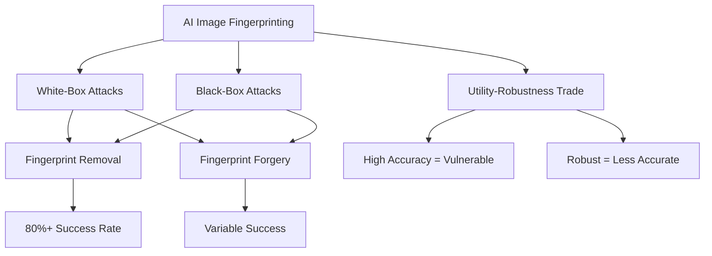

# Smudged Fingerprints: A Systematic Evaluation of the Robustness of AI Image Fingerprints

## Paper Overview
This paper presents the first systematic security evaluation of AI image fingerprinting techniques, examining their robustness under adversarial conditions. It formalizes threat models for both white- and black-box access scenarios with two attack goals: fingerprint removal and fingerprint forgery.

## Technical Details
- **Attack Strategies**: Five different methods implemented to evaluate fingerprinting techniques
- **Fingerprinting Methods**: 14 representative approaches tested across RGB, frequency, and learned-feature domains
- **Generators Tested**: 8 state-of-the-art image generators
- **Performance Gap**: Significant difference between clean and adversarial performance

## Key Findings
- Removal attacks are highly effective (success rates above 80% in white-box settings)
- Forgery attacks are more challenging but still effective
- Trade-off between utility and robustness: most accurate methods are vulnerable to attacks
- Residual- and manifold-based fingerprints show stronger black-box resilience

## Mermaid Diagram

## Multi-Stakeholder Perspectives

### Data Scientists
- **Technical Focus**: The paper introduces novel attack strategies and evaluates existing methods systematically 
- **Evaluation Metrics**: Uses success rates and attack effectiveness in different settings
- **Implementation**: Framework for testing robustness in adversarial scenarios
- **Novelty**: First systematic evaluation of fingerprinting techniques under adversarial conditions

### Compliance Officers
- **Privacy Risk Assessment**: Demonstrates vulnerability of current fingerprinting techniques to adversaries
- **Security Standards**: Highlights need for robust techniques meeting privacy requirements
- **Regulatory Impact**: Important for compliance with data protection regulations
- **Privacy Budgets**: Suggests need for more careful privacy consideration in fingerprinting applications

### Executives
- **Business Impact**: Reveals critical vulnerabilities in AI attribution systems
- **Risk Management**: Identifies gap between current security and needs
- **Investment Needs**: Highlights need for more robust security in AI image systems
- **Strategic Priority**: Emphasizes need for robust attribution security

## Key Takeaways
1. Current fingerprinting techniques are vulnerable to adversarial attacks
2. Attackers can effectively remove or forge fingerprints, reducing attribution accuracy
3. There's a fundamental trade-off between utility and robustness
4. Need for more robust techniques that work under adversarial conditions

## Research Implications
- New attack methodologies require defensive approaches
- Defense strategies need to consider both white and black-box scenarios
- Trade-offs between accuracy and robustness should be better understood
- Future research should focus on robust, practical fingerprinting approaches