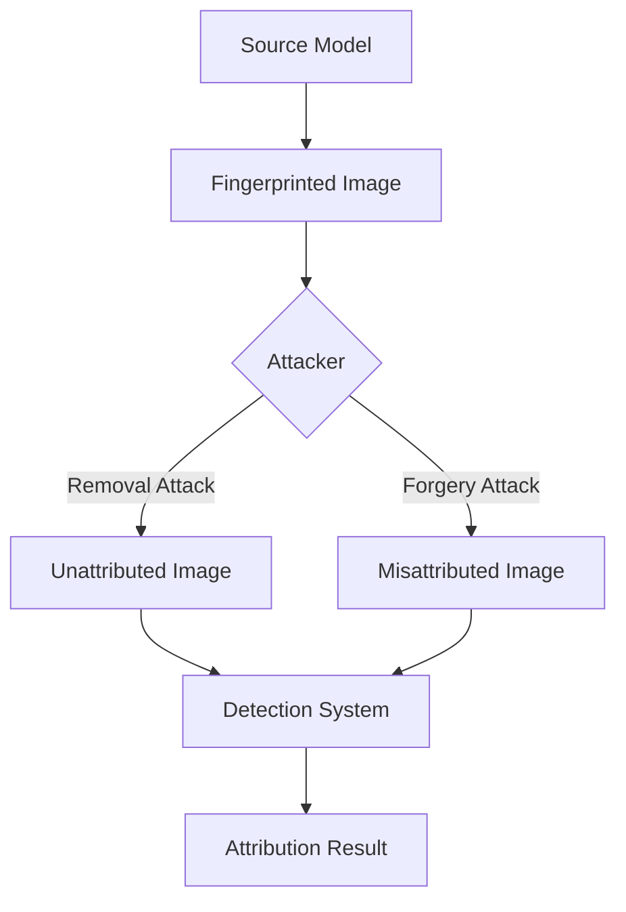

# Smudged Fingerprints: Robustness of AI Image Fingerprints

## 📝 Summary
The paper systematically evaluates the security of AI image fingerprinting techniques used to attribute images to their source models. It reveals a significant gap between performance in clean settings and adversarial settings, proving that fingerprint removal and forgery attacks are highly effective.

## 📐 Architecture & Workflow

## 👥 Stakeholder Perspectives

### 🧪 Data Scientists
- **Insight**: High attribution accuracy in clean data often correlates with high vulnerability. Use manifold-based fingerprints for better black-box resilience.
- **Key Metric**: Success rate of removal attacks (>80% white-box, >50% black-box).

### ⚖️ Compliance Officers
- **Insight**: Fingerprints should not be relied upon as a sole "proof of origin" for legal or regulatory compliance without considering adversarial robustness.

### 📈 Executives
- **Insight**: Current "watermarking" or fingerprinting tools provide a false sense of security. Investment is needed in adversarial-robust attribution.
