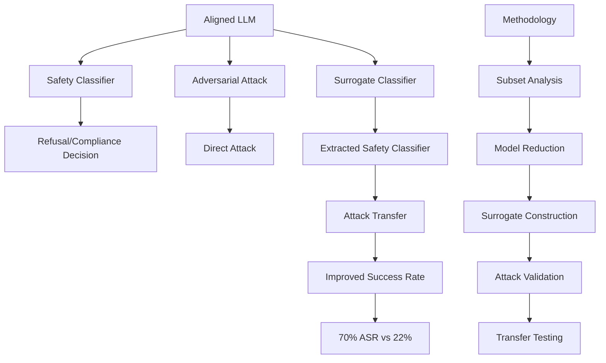

# Targeting Alignment: Extracting Safety Classifiers of Aligned LLMs

## Paper Overview
This paper introduces a novel technique for jailbreak attacks on aligned LLMs, examining how alignment embeds a safety classifier in the model that decides between refusal and compliance. The approach focuses on extracting a surrogate classifier to approximate this safety mechanism.

## Technical Details
- **Method**: Build candidate classifiers from subsets of the LLM
- **Evaluation**: Tests degree to which candidate classifiers approximate LLM's safety classifier
- **Attack Transfer**: Measures transferability of adversarial inputs to the original LLM
- **Efficiency**: Best candidates achieve 80% F1 score with 20% of model architecture
- **Performance Comparison**: Surrogate using 50% of Llama 2 achieved 70% ASR vs 22% for direct attack

## Key Findings
- Alignment embeds a safety classifier that can be extracted as a surrogate
- Surrogate classifiers achieve high accuracy (80% F1) with minimal model portions
- Attack transfer from surrogate to original LLM is highly effective
- Significant improvement in attack success rate with reduced resource usage
- Shows vulnerability of aligned models to jailbreaking attacks

## Mermaid Diagram

## Multi-Stakeholder Perspectives

### Data Scientists
- **Novel Attack Technique**: Shows extraction of safety classifiers as a new attack vector
- **Surrogate Modeling**: Introduction of surrogate classifiers for attack approximation
- **Performance Metrics**: Demonstrates F1 score and attack success rate comparisons
- **Technical Approach**: Uses subset analysis and model reduction for classifier extraction

### Compliance Officers
- **Security Vulnerability**: Highlights critical weakness in aligned LLM security
- **Privacy Risk**: Shows potential for bypassing safety measures
- **Governance Impact**: Demonstrates need for more robust alignment mechanisms
- **Regulatory Concerns**: Addresses risks for compliance with AI safety requirements

### Executives
- **Business Risk**: Significant vulnerability in aligned AI systems
- **Security Investment**: Need for enhanced protection of aligned models
- **Competitive Risk**: Vulnerability could impact market positioning
- **Operational Impact**: Threats to AI safety mechanisms that enterprises rely on

## Key Takeaways
1. Aligned LLMs have embedded safety classifiers that can be extracted
2. Surrogate classifiers can achieve high accuracy with minimal model portions
3. Attack success rates improve significantly when using surrogate classifiers
4. Current alignment mechanisms provide insufficient protection against jailbreaks

## Research Implications
- Shows the fundamental vulnerability of alignment-based safety mechanisms
- Opens research directions for more robust alignment methods
- Demonstrates the value of surrogate model extraction techniques
- Highlights need for alternative safety verification methods