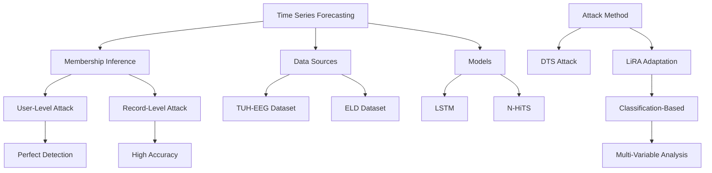

# Privacy Risks in Time Series Forecasting: User- and Record-Level Membership Inference

## Paper Overview
This paper introduces two new attacks for membership inference in time series forecasting: adaptation of multivariate LiRA and a novel Deep Time Series (DTS) attack. It evaluates these methods on realistic datasets targeting LSTM and N-HiTS forecasting architectures.

## Technical Details
- **Attack Methods**: 
  - Adapted multivariate LiRA (state-of-the-art for classification)
  - Novel Deep Time Series (DTS) attack
- **Datasets**: TUH-EEG and ELD datasets
- **Models**: LSTM and N-HiTS forecasting architectures
- **Threat Models**: Record-level and user-level privacy risks
- **Vulnerability**: User-level attacks often achieve perfect detection

## Key Findings
- Forecasting models are vulnerable to membership inference attacks
- User-level attacks achieve perfect detection accuracy
- Vulnerability increases with longer prediction horizons and smaller training populations
- Similar trends observed as in large language models
- DTS attack achieves strongest performance in several settings

## Mermaid Diagram

## Multi-Stakeholder Perspectives

### Data Scientists
- **Attack Evaluation**: Comprehensive benchmarking of different MIA approaches
- **Technical Approach**: Novel adaptation of LiRA to time series forecasting
- **Performance Metrics**: Shows user-level attacks achieving perfect detection
- **Dataset Analysis**: Realistic evaluation on established EEG and ELD datasets

### Compliance Officers
- **Privacy Risk**: Demonstrates strong privacy vulnerabilities in time series forecasting
- **Regulatory Impact**: High-risk scenarios for data protection regulations
- **Compliance Requirements**: Highlights gap in current privacy protection methods
- **Data Handling**: Addresses requirements for sensitive time series data

### Executives
- **Risk Assessment**: High privacy risk in time series forecasting applications
- **Market Impact**: Impacts industries using forecasting models for sensitive data
- **Security Investment**: Justifies investment in privacy-enhancing techniques
- **Governance**: Highlights need for better data governance in forecasting systems

## Key Takeaways
1. Time series forecasting models are highly vulnerable to membership inference attacks
2. User-level attacks can achieve perfect detection, posing severe privacy risks
3. Vulnerability increases with prediction horizon and smaller training sets
4. DTS attack establishes new baselines for privacy risk assessment

## Research Implications
- Need for privacy-enhancing techniques in time series forecasting
- Importance of understanding privacy gaps in specialized ML domains
- Methodology transfer between different ML tasks
- Development of more robust privacy-preserving forecasting approaches