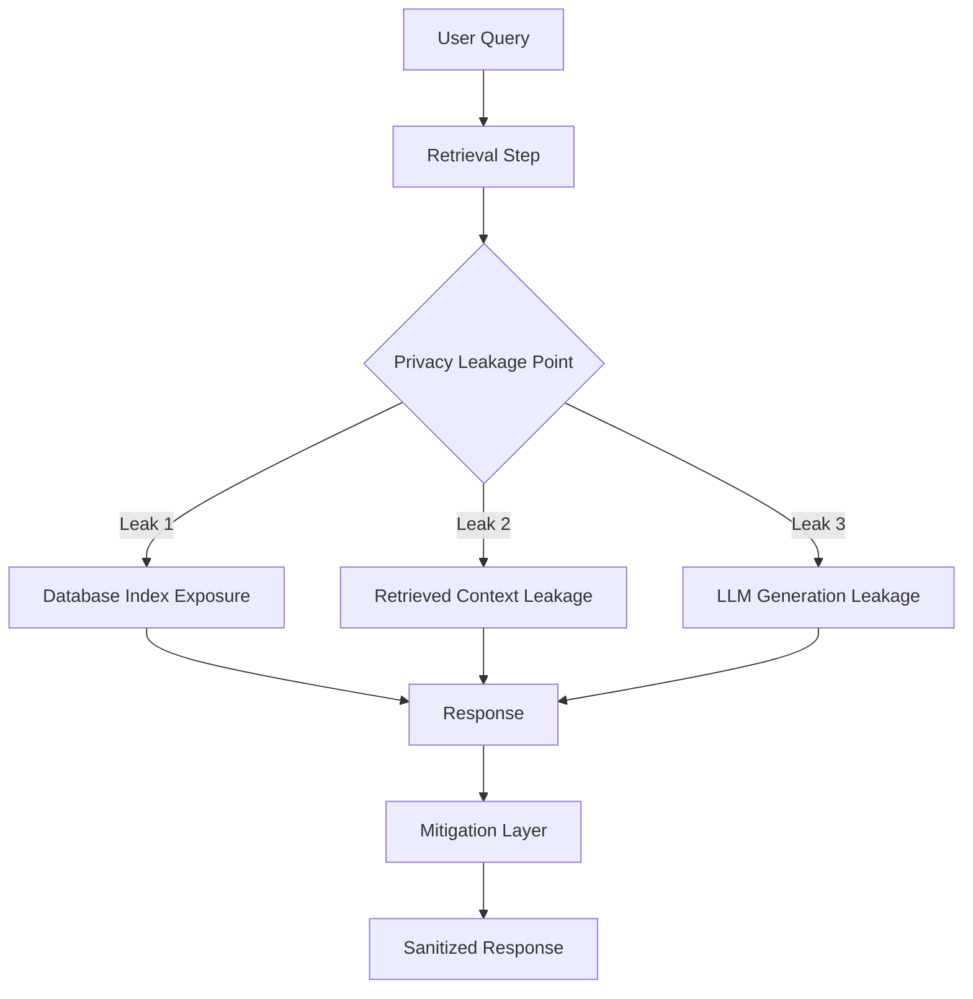

# SoK: Privacy Risks and Mitigations in RAG Systems

## 📝 Summary
This paper systematizes the privacy landscape of Retrieval-Augmented Generation (RAG). It identifies how the coupling of LLMs with domain-specific databases introduces new leakage vectors and proposes a taxonomy for these risks.

## 📐 RAG Privacy Process

## 👥 Stakeholder Perspectives

### 🧪 Data Scientists
- **Insight**: Privacy is not just about the LLM, but about the "retrieval bridge." We must analyze the leakage at the embedding/index level as well as the generation level.

### ⚖️ Compliance Officers
- **Insight**: RAG systems often bypass traditional data access controls. A new "RAG-specific" privacy impact assessment (PIA) is needed.

### 📈 Executives
- **Insight**: RAG allows using proprietary data, but if not secured, it becomes a "privileged access" leak where users can query information they shouldn't have access to via the LLM.
