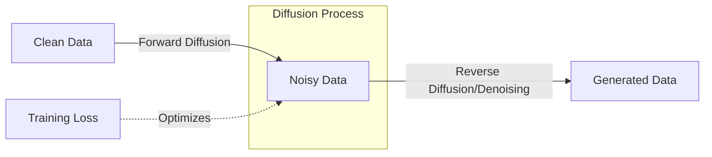

# Deep Unsupervised Learning using Nonequilibrium Thermodynamics

## Overview
This seminal paper introduces the foundation of diffusion models by drawing inspiration from non-equilibrium statistical physics. It proposes a generative model that systematically destroys structure in data and then learns to reverse this process to generate new data samples.

## Key Concepts
- **Forward Process**: A Markov chain that gradually adds noise to data, eventually transforming it into a simple distribution (e.g., Gaussian).
- **Reverse Process**: A learned model that attempts to undo the forward noise addition, effectively "denoising" the sample back to the original data distribution.
- **Tractability**: By using a slow diffusion process, the reverse transitions can be approximated by Gaussian distributions, making the complex generative task computationally tractable.

## Architecture Diagram

## Relation to other papers
- Foundations for almost all subsequent diffusion work, including [[Structured Denoising Diffusion Models in Discrete State-Spaces]].
