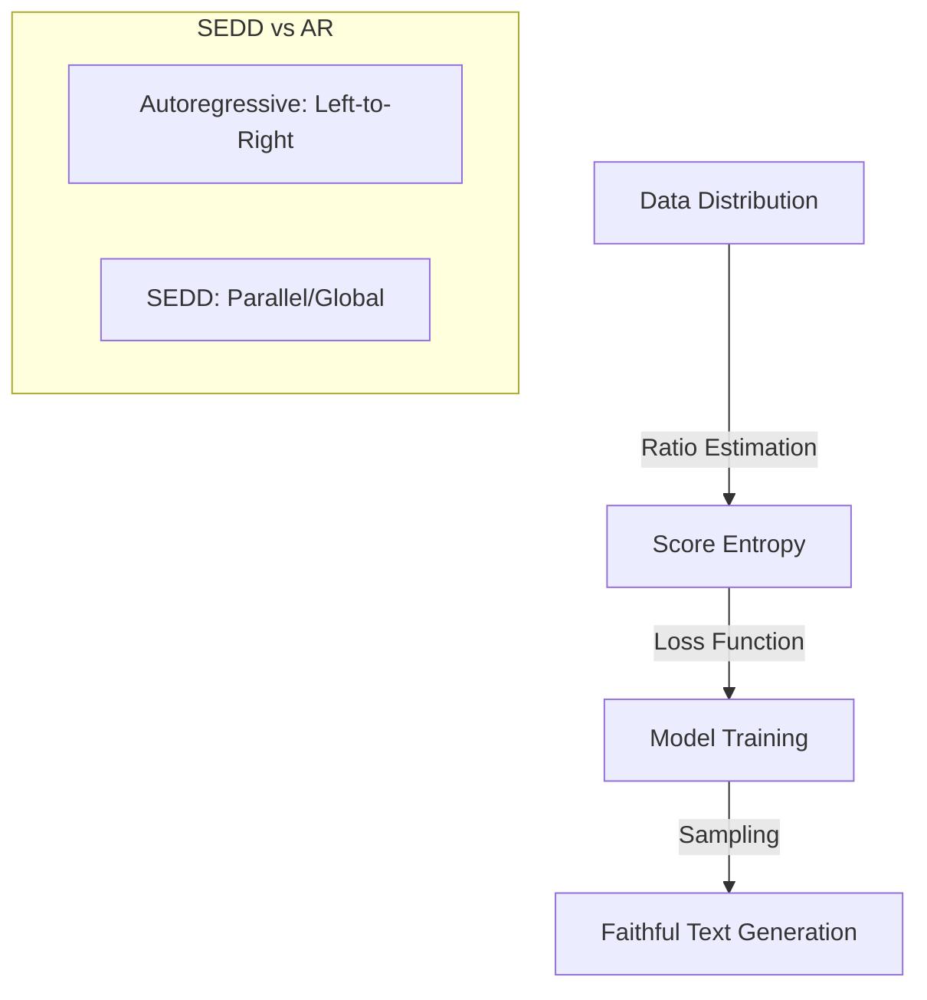

# Discrete Diffusion Modeling by Estimating the Ratios of the Data Distribution

## Overview
This paper introduces **Score Entropy Discrete Diffusion (SEDD)**, aiming to bridge the gap between the high performance of continuous diffusion (score matching) and the challenges of discrete data.

## Key Concepts
- **Score Entropy**: A novel loss function that extends the concept of score matching to discrete spaces.
- **Ratio Estimation**: Instead of predicting the mean of a Gaussian, it estimates the ratios of the data distribution.
- **Performance**: Outperforms previous discrete diffusion models and is competitive with autoregressive models like GPT-2.
- **Controllable Infilling**: Naturally supports infilling without the rigid left-to-right constraint of AR models.

## Architecture Diagram

## Relation to other papers
- Addresses the "score matching" gap identified in previous discrete diffusion research.
- Competitive alternative to [[Simple and Effective Masked Diffusion Language Models]].
