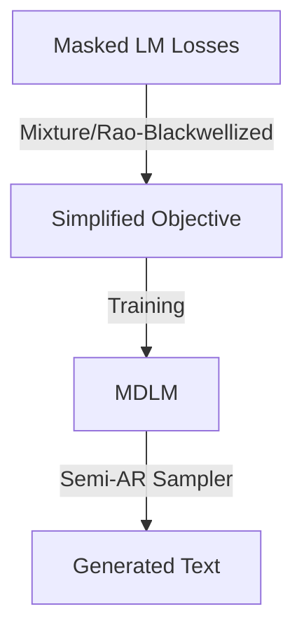

# Simple and Effective Masked Diffusion Language Models

## Overview
This paper argues that simple masked discrete diffusion is more powerful than previously thought, provided the right training recipes and a Rao-Blackwellized objective are used.

## Key Concepts
- **Rao-Blackwellized Objective**: A simplified objective that is a mixture of classical masked language modeling (MLM) losses.
- **Modern Engineering**: Emphasizes the role of training recipes (optimization, schedules) over complex model architectures.
- **Semi-Autoregressive Sampling**: Enables efficient samplers that can generate arbitrary lengths of text.
- **Performance**: Approaches the perplexity of Autoregressive (AR) models.

## Architecture Diagram

## Relation to other papers
- Similar goals to [[Simplified and Generalized Masked Diffusion for Discrete Data]] but focuses more on the training recipe and objective simplification.
- Bridges the gap between MLMs (like BERT) and Generative Diffusion.
