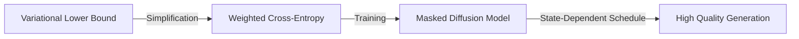

# Simplified and Generalized Masked Diffusion for Discrete Data

## Overview
This paper provides a general framework for masked diffusion, simplifying the mathematical formulations and introducing state-dependent masking schedules to unlock better performance.

## Key Concepts
- **Simplified Objective**: Shows that the continuous-time variational objective is essentially a weighted integral of cross-entropy losses.
- **State-Dependent Masking**: Allows the masking process to vary based on the token, rather than a fixed global schedule.
- **Generalization**: Surpasses previous diffusion LMs at GPT-2 scale and performs exceptionally well on pixel-level image modeling.

## Architecture Diagram

## Relation to other papers
- Simplifies the complexity found in [[Structured Denoising Diffusion Models in Discrete State-Spaces]].
- Sets a new benchmark for GPT-2 scale diffusion models.
