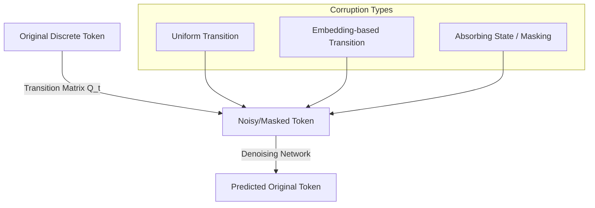

# Structured Denoising Diffusion Models in Discrete State-Spaces

## Overview
This paper extends the diffusion framework to discrete state spaces, which is critical for tasks like text generation and categorical data modeling. It introduces Discrete Denoising Diffusion Probabilistic Models (D3PMs).

## Key Concepts
- **Discrete State Spaces**: Unlike continuous Gaussian noise, this model handles categorical transitions.
- **Transition Matrices**: Introduces flexible transition matrices $Q_t$ to define how data is corrupted.
- **Absorbing States**: A specific type of transition where data is moved to a special `[MASK]` token, creating a bridge between diffusion models and masked language models (MLMs).
- **Loss Function**: Combines the variational lower bound (VLB) with an auxiliary cross-entropy loss for better stability.

## Architecture Diagram

## Relation to other papers
- Generalizes the multinomial diffusion model.
- Directly influences [[Simplified and Generalized Masked Diffusion for Discrete Data]].
