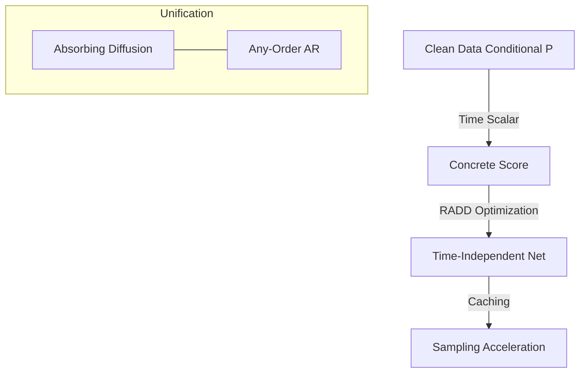

# Your Absorbing Discrete Diffusion Secretly Models the Conditional Distributions of Clean Data

## Overview
This paper analyzes absorbing discrete diffusion models and reveals that the "concrete score" they estimate is actually a time-dependent version of the conditional probabilities of clean data.

## Key Concepts
- **Concrete Score**: The ratio between marginal probabilities of transitive states.
- **Reparameterized Absorbing Discrete Diffusion (RADD)**: A model that removes the time-dependence from the network, focusing on the time-independent conditional probabilities.
- **Computational Efficiency**: RADD allows for caching outputs if the noisy sample doesn't change, reducing the number of function evaluations (NFEs).
- **Unification**: Unifies absorbing diffusion with Any-Order Autoregressive Models (AO-ARMs).

## Architecture Diagram

## Relation to other papers
- Deepens the theoretical understanding of [[Structured Denoising Diffusion Models in Discrete State-Spaces]].
- Provides a path for acceleration seen in "Fast Sampling" papers.
