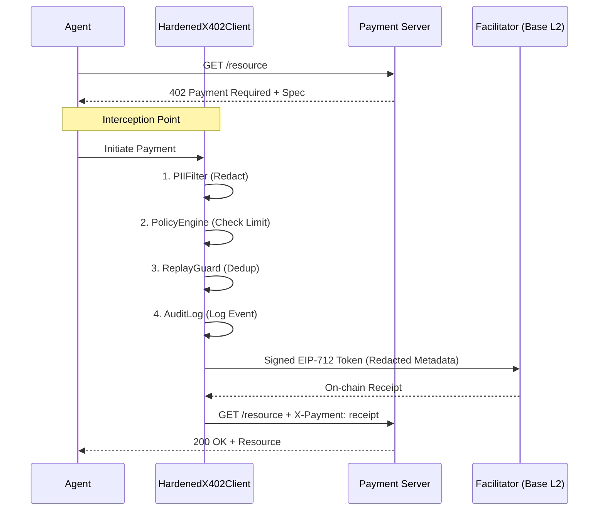

# Hardening x402: PII-Safe Agentic Payments

## Overview
This paper presents **presidio-hardened-x402**, an open-source middleware designed to secure payments made by AI agents using the x402 protocol. The primary goal is to prevent the leakage of Personally Identifiable Information (PII) and protect agent wallets from draining or replay attacks.

### The Problem: The x402 "PII Leak"
The x402 protocol (backed by Coinbase) allows AI agents to pay for resources via HTTP. However, every payment request includes metadata:
- **Resource URL**: The URL of the resource being paid for.
- **Description**: A human-readable label.
- **Reason**: A client-supplied annotation.

**The Risk:** These fields are transmitted in plaintext to the payment server and a centralized facilitator API. Because neither party is typically bound by a data processing agreement, this leads to significant privacy risks (GDPR violations) and security vulnerabilities.

## Summary of Contributions
1. **HardenedX402Client**: A Python wrapper (middleware) that intercepts requests before they are signed/sent.
2. **Synthetic Corpus**: A dataset of 2,000 labeled x402 metadata triples for testing PII filters.
3. **Parameter Sweep**: An evaluation of 42 different configurations to find the optimal PII detection settings.
4. **Latency Analysis**: Confirmation that the security overhead is well within acceptable limits (p99 < 6ms).

## System Architecture
The middleware applies four security controls in a strict sequence:
1. **PIIFilter**: Scans and redacts PII using Microsoft Presidio (Regex + NLP).
2. **PolicyEngine**: Enforces spending limits (per-call, daily, per-endpoint).
3. **ReplayGuard**: Prevents double-charging via HMAC-SHA256 fingerprinting.
4. **AuditLog**: Creates a tamper-evident, HMAC-chained JSON-L log of all decisions.

### Payment Flow Diagram

## Key Findings
- **NLP vs Regex**: NLP is slower but essential. Regex cannot detect human names (`PERSON`), which are a major PII risk.
- **PERSON Recall Gap**: There is a "ceiling" on detecting names in URLs because NER models lack grammatical context in slugs (e.g., `/user/john-smith`).
- **Recommended Config**: `mode=nlp`, `all entities`, `min_score=0.4`.
- **Performance**: p99 latency is ~5.73ms, which is negligible compared to the 50ms budget.
